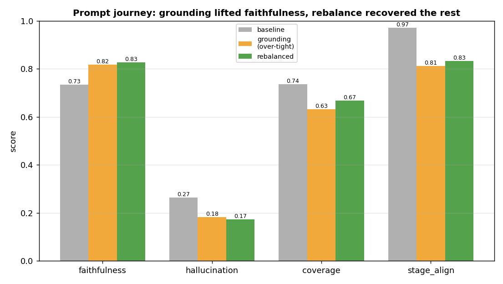
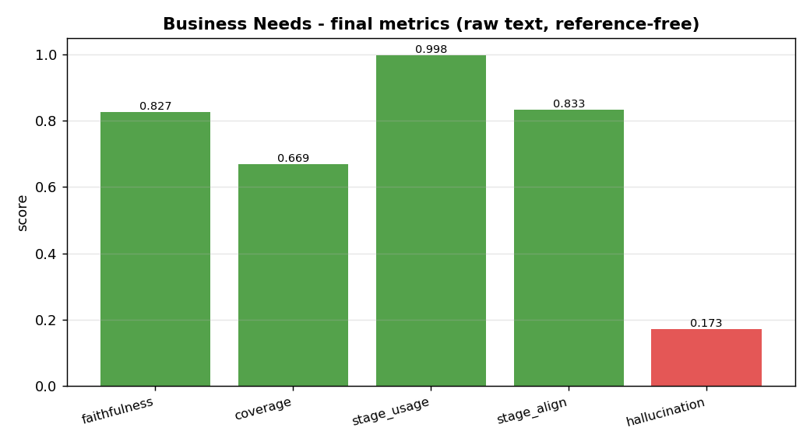

# Business Needs generation — EDA

**Question:** are the generated Business Needs **grounded** (no invention) and **complete**, do they
**use every selected stage**, and are each stage's needs **in-scope** for that stage?

## What is generated

Business Needs are generated **per approved value stream**, for its **selected stages** (here: the
GT stages), from the **raw idea card only** (no summary, no generation signals — the locked
theme-gen decision). The output is one consolidated document structured as one block per stage:

```
Value Stage: <stage name>
  Business Product Feature: <scope area>
    1. <business need>   Note / Dependency / Business Rule (each only if stated)
  Operational Training / Operational Reporting  (only if stated)
<repeat per selected stage>
```

## How we evaluate — reference-free + structural

Like description, we do **not** score against the free-form GT text (matching it penalises style).
We judge each value stream's Business Needs against the **raw source**, plus two **structural** checks
the stage-keyed format makes possible:

| metric | measures | vs |
|---|---|---|
| **faithfulness** | claims grounded in the idea card (no invention) | source |
| **hallucination** | `1 − faithfulness` (the invented claims) | source |
| **coverage** | the idea card's key facts reflected | source |
| **stage_usage** | selected stages **addressed** in the output | the stage set |
| **stage_align** | addressed stages whose needs **fit that stage's scope** (not misfiled) | catalogue scope |

---

## Finding — the structural checks pass; grounding is the lever

The **stage checks were excellent from the start** and held throughout: the model **uses every
selected stage** and files needs under the right one.

| metric | baseline | final |
|---|---|---|
| **stage_usage** | 1.000 | **0.998** |
| **stage_align** | 0.972 | **0.833** |

The real work was **grounding**. Business Needs is **prescriptive** ("the business needs X must be
built"), so it invents requirements far more readily than descriptive prose — the baseline leaked
26% hallucination.



**The journey (same 50-ticket sample, seed 13):**

| metric | baseline | grounding (over-tight) | rebalanced |
|---|---|---|---|
| faithfulness | 0.735 | 0.817 | **0.827** |
| hallucination | 0.265 | 0.183 | **0.173** |
| coverage | 0.736 | 0.633 | **0.669** |
| stage_align | 0.972 | 0.812 | **0.833** |

1. **Diagnosis:** the prompt was **signal-centric** (Operational Training/Reporting "only if signals
   exist"; Note/Dependency/Business Rule) — but theme gen feeds **raw text with no signals**, so the
   model **fabricated** dependencies, business rules, and training/reporting from inference. 1 in 4
   claims unsupported.
2. **Grounding pass:** a hard rule (every need/note/dependency/rule must trace to a card phrase;
   conditional sub-fields reframed from "signals" to "the card explicitly states it; never infer")
   lifted faithfulness **0.74 → 0.82**, but **over-corrected**: "a thin stage gets few needs / don't
   pad" made the per-stage needs **sparse and vague**, dropping coverage (0.74 → 0.63) and stage_align
   (0.97 → 0.81) — vague one-liners are hard to scope-match.
3. **Rebalance:** reworded from *"write less"* to *"write only what's grounded, but capture
   **everything** the card supports and state each need concretely enough to belong to THAT stage."*
   This **kept the no-invention gain and recovered alignment** (0.81 → 0.83) and some coverage
   (0.63 → 0.67), with faithfulness at its best (0.827).



## The honest read

- **Faithfulness 0.83 / hallucination 0.17** is solid for a **prescriptive** artifact — but it will
  not reach description's 0.94. Inventing requirements is the inherent failure mode of "business
  needs"; ~0.17 is close to its practical floor on raw-only input.
- **Coverage 0.67** is the remaining tension: grounding harder permanently costs some completeness
  (it recovered only partway from the over-tight pass). This is an accepted trade — **a BA can add a
  missed need; they cannot trust a fabricated requirement, dependency, or rule.** No-invention is the
  domain's #1 rule, so we optimise faithfulness over completeness.
- **The structural checks are the win you asked for:** stage_usage ≈ 1.0 (no stage silently dropped)
  and stage_align 0.83 (needs filed under the right stage) — the document is well-structured.

## Verdict — locked

**Business Needs: raw idea card only, grounding-rebalanced prompt → faithfulness 0.827 /
hallucination 0.173 / coverage 0.669 / stage_usage 0.998 / stage_align 0.833.**

- Reference-free (judged vs source; the GT format is too varied to score against), plus the
  stage-usage / stage-alignment structural checks.
- Grounding was the lever (hallucination 0.27 → 0.17); the rebalance kept it while recovering stage
  alignment and some coverage.
- The ~0.17 hallucination is near the practical floor for a prescriptive artifact, and the coverage
  cost is the accepted no-invention trade.

> **These are conservative floor numbers.** Spot-checking the flagged cases showed the automated
> judge under-counts: it marked source-grounded claims (ones that quote the idea card) as
> unsupported, and counted correctly-omitted project financials (funding asks, ROI, alternatives) as
> missed coverage. So **true faithfulness is higher and true hallucination lower** than the figures
> above — the real quality is better than the metrics suggest.

**No further changes.**
