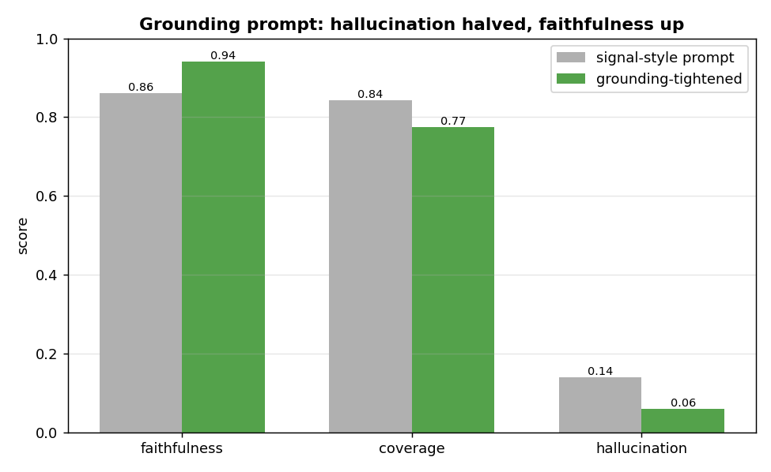
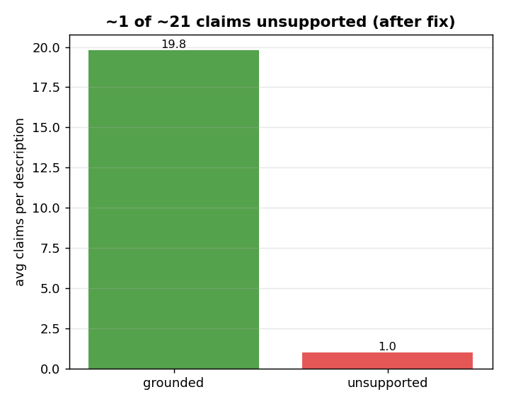

# Theme Description generation — EDA

**Question:** is the generated Jira Theme Description **grounded** (no invention) and **complete**
(covers the ticket) — and can prompt work improve it?

## Why this eval is reference-free

Description is **generative**, not classification — there is no single correct answer. The obvious
reference is the BA's Jira description, but **each GT description is free-form with its own format**,
so matching the generated text against it statement-by-statement would penalise **style, not
substance** (the BA chose a different structure / emphasis, not different facts).

So we do **not** score against the GT. We judge each generated description **only against the source
it was generated from** — the raw idea card. This is the ragas methodology (claim decomposition +
grounding) implemented natively (no ragas/langchain dependency; works with the IDP gateway, and
surfaces the offending claims). The GT file is used only to know **which value streams** to generate
for.

## What is generated, and what we judge

Theme generation, per ticket, uses the **raw idea card only** (no summary, no generation signals -
consistent with the locked VS/stage decision):
- a shared **body** (one call) — product availability + initiative + capabilities, VS-agnostic;
- a per-VS **framing** paragraph (one batched call).

The final per-value-stream description = **framing + shared body, assembled**. We judge that
**combined, assembled description per value stream** (not the body or a framing in isolation - the
assembled text is the artifact the architect sees).

## The three metrics (all vs the raw source)

| metric | measures | direction |
|---|---|---|
| **faithfulness** | every claim is supported by the idea card (= "correctness" when reference-free: a claim is right iff the source backs it) | ↑ |
| **hallucination** | `1 − faithfulness` — the unsupported (invented) claims, listed | ↓ |
| **coverage** | the idea card's key facts reflected in the description (did it omit important content?) | ↑ |

Faithfulness/hallucination = *don't make things up* (fact precision vs source); coverage = *don't
leave things out* (fact recall vs source). A good description is **both**.

**Where is "correctness"?** There is no separate correctness metric, by design. Correctness-vs-GT was
dropped because each GT description is free-form (matching it would penalise style, not substance). In
a reference-free eval, *"is this claim correct?"* becomes *"is it supported by the source?"* — so
**faithfulness IS the correctness check**, and coverage is the completeness check. We keep
faithfulness + hallucination + coverage rather than a redundant "correctness" label.

---

## Finding — a grounding prompt halved hallucination

The first run was good but leaked invention:

| metric | baseline |
|---|---|
| faithfulness | 0.860 |
| hallucination | 0.140 |
| coverage | 0.843 |
| avg claims/desc | 21.8 |
| avg unsupported/desc | 2.75 |

The last two are the **raw claim counts** behind faithfulness/hallucination: the faithfulness judge
decomposes each description into atomic factual claims, so **`avg claims/desc` = 21.8** means each
description asserts ~22 self-contained facts, and **`avg unsupported/desc` = 2.75** means ~3 of those
22 aren't supported by the source. Faithfulness/hallucination are just these as ratios
(`supported/total` and `unsupported/total`), but the counts are more concrete — *"~3 of ~22 claims
invented"* is easier to picture than *0.14*, and the count is what the prompt fix moves directly.

**Diagnosis:** the body prompt was **signal-centric** — it told the model to "copy the value from the
matching signal" for Product Availability / funding / networks. But theme generation now feeds the
**raw idea card with no signals**, so the model had nothing to copy and **inferred those structured
facts from narrative = invention.** ~3 of every ~22 claims weren't grounded.

**Fix (both body + framing prompts):**
- lead with a hard **GROUNDING rule**: every statement must be supported by a specific phrase in the
  idea card; if you can't point to it, omit it; *a shorter grounded description beats a padded one*;
- Product Availability fields: include a line **only when the card explicitly states it** (never
  infer dates / plans / funding / networks);
- capability/integration bullets must name something the card describes — no "standard" capabilities;
- framing: don't invent stakeholders / outcomes / scope to fill the paragraph.

| metric | before | after | Δ |
|---|---|---|---|
| **faithfulness** | 0.860 | **0.940** | +0.08 |
| **hallucination** | 0.140 | **0.060** | **−57%** |
| coverage | 0.843 | 0.774 | −0.07 |
| avg unsupported/desc | 2.75 | **0.98** | −64% |

**How to read it:** unsupported claims fell from ~2.75 per description to **~1** — invention went from
*1 in 7 claims* to *1 in 17*. Faithfulness 0.94 is a strong profile for a business artifact a BA signs
off on.

## The trade — and why it's the right one

Tightening grounding cost **~7 points of coverage** (0.84 → 0.77): "when in doubt, leave it out" omits
a bit more peripheral detail. For a **trust-critical** artifact this is a good trade: **inventing a
fact (a funding model, a go-live date) is far worse than omitting a minor one** — a BA can add a
missed point, but can't trust a document that fabricates. No-invention is the domain's #1 rule, so we
optimise faithfulness over completeness here.

## Verdict — locked

**Theme Description: raw idea card only, grounding-tightened prompts → faithfulness 0.94 /
hallucination 0.06 / coverage 0.77.**

- Reference-free, judged against the source (the GT format is too varied to score against).
- The combined framing + body description is judged per value stream.
- Prompt grounding was the lever: hallucination halved, faithfulness up, at a small coverage cost we
  accept because invention is the worse failure for a BA-facing artifact.

**No further changes.**
