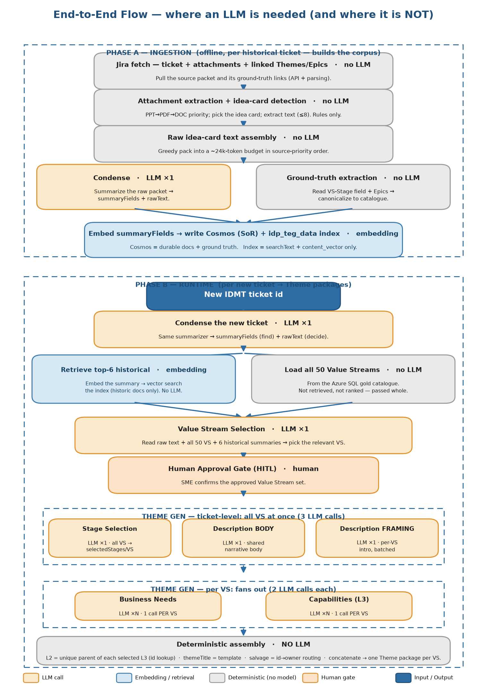

# End-to-end flow — the whole pipeline, stage by stage

**Purpose:** the single reference for the complete system: from a raw IDMT ticket / idea card to the
final Theme packages. For each stage it gives **what it does · input · output · LLM or not · the rule
that matters**. Companion docs: `llm_invocation_flow.md` (the "where's the LLM and why" lens) and the
per-component EDAs (the measured quality of each step).



There are two phases. **Phase A (ingestion)** runs offline over historical tickets to build the corpus
(Cosmos system-of-record + the retrieval index). **Phase B (runtime)** runs per new ticket to produce
Theme packages. Phase B reuses the same Condense step and reads what Phase A stored.

---

## Phase A — Ingestion (offline, per historical ticket)

### A1. Jira fetch  ·  no LLM
- **Does:** pull the ticket, its attachments, and its linked Themes/Epics (the ground-truth artifacts).
- **In:** IDMT ticket id. **Out:** raw ticket packet + linked issue ids.
- **Rule:** only Engagement Requests after 2023-01-01 with a linked Theme are eligible.

### A2. Attachment extraction + idea-card detection  ·  no LLM
- **Does:** find the idea card (named/tagged `idea_card.ppt/pptx`); else fall back to description +
  supported attachments in priority order **PPT → PDF → DOC**, up to **8**.
- **In:** attachments. **Out:** extracted text per source.
- **Rule:** PPT first (SMEs confirmed it's the most common idea-card format).

### A3. Raw idea-card text assembly  ·  no LLM
- **Does:** concatenate description + extracted attachments, greedily packed into a **~24k-token budget**
  in source-priority order.
- **In:** extracted texts. **Out:** `rawText` (one consolidated blob).
- **Rule:** highest-priority content is never displaced or truncated to fit lower-priority attachments.

### A4. Condense  ·  **LLM ×1**
- **Does:** summarize the raw packet into structured fields.
- **In:** `rawText`. **Out:** `summaryFields` = {generatedSummary, businessProblem, businessCapability,
  keyTerms, stakeholders, systemsAndProducts}, plus `rawText` passed through.
- **Rule:** summaries are for *finding* (retrieval); raw text is for *deciding* (generation).

### A5. Ground-truth extraction  ·  no LLM
- **Does:** read the BA's recorded answer — the Value Stream from linked Themes and the stages/L3 from
  the Epics' **VS-Stage cascading field** — and canonicalize against the catalogue.
- **In:** linked Themes/Epics. **Out:** `themes[]` GT (VS) + stage/L3 GT.
- **Rule:** drop labels not in the catalogue (retired); never invent — the answer is already recorded.

### A6. Embed → write Cosmos + index  ·  embedding (no generation call)
- **Does:** embed the retrieval text and persist.
- **Out:** **Cosmos** = durable IDMT/Theme documents + ground truth (system of record). **idp_teg_data
  index** = `searchText` + `content_vector` only (retrieval-only; no labels/themes/signals stored).
- **Rule:** the index returns ranked ids; all detail is enriched from Cosmos / Azure SQL at query time.

---

## Phase B — Runtime (per new ticket → Theme packages)

### B1. New ticket → Condense  ·  **LLM ×1**
- Same Condense as A4, on the new ticket. **Out:** `summaryFields` (the retrieval query) + `rawText`
  (what generation reads). *(The standalone `scripts/predict_value_streams.py` enters here, taking the
  idea card text directly.)*

### B2. Retrieve top-6 historical  ·  embedding (no LLM)
- **Does:** embed the new ticket's **summary**, vector-search the index.
- **Out:** the **6 most similar historical tickets** (ids); their summary + tagged-VS ground truth are
  read from Cosmos. Shown to the SME for relevance.
- **Rule:** retrieval query is the **summary** (embeds the whole ticket cleanly; beats raw — R 0.90 vs 0.84).

### B3. Load the 50 Value Streams  ·  no LLM
- **Does:** load the full governed catalogue (name, description, category, trigger, value proposition,
  assumptions) from the **Azure SQL DB** (org gold data; *integration pending*).
- **Rule:** Value Streams are **not** in the index and **not** retrieved/ranked — the whole set is passed in.

### B4. Value Stream Selection  ·  **LLM ×1**
- **Does:** pick the relevant Value Streams.
- **In:** new ticket **raw text** + the **50 candidate blocks** + the **6 historical tickets as
  summaries** (with their tagged VS) + the requested count (default 10).
- **Out:** `recommendations[]` = {valueStreamId, valueStreamName, confidence 0–100, supportType
  direct|implied, reason, sourceTickets (implied only)}.
- **Rule:** raw text is the lever (+0.071 F1 over summary); no lanes/buckets/pre-ranking — the model decides.

### B5. Human Approval Gate (HITL)  ·  human
- **Does:** SME confirms the approved Value Stream set. **No generation runs before this.**

### B6. Theme generation — ticket-level band  ·  **3 LLM calls** (all VS at once, in parallel)
| call | in | out | LLM |
|---|---|---|---|
| **Stage Selection** | raw text + per-VS governed candidate stages | `selectedStages` per VS {stageId, stageName, reason} | ×1 (all VS batched) |
| **Description BODY** | raw text | shared narrative body (string) | ×1 |
| **Description FRAMING** | raw text + per-VS {id, name, description, valueProposition} | per-VS framing paragraph | ×1 (all VS batched) |
- **Rules:** no count cap (recall-first); STRICT VS ISOLATION; a stage under the wrong VS is **salvaged**
  to its owner (deterministic). Description grounding: every line traces to an idea-card phrase.

### B7. Theme generation — per-VS band  ·  **2 LLM calls per VS** (fans out across N VSs)
| call | in | out | LLM |
|---|---|---|---|
| **Business Needs** | raw text + VS {id, name, description, valueProposition} + that VS's selected stages | one consolidated Business Needs text (one "Value Stage:" block per stage) | ×N |
| **Capabilities (L3)** | raw text + VS {id, name} + each selected stage's governed candidate L3 | L3 per stage {capabilityId, name, reason} | ×N |
- **Rules:** both **wait for Stage Selection**; STRICT STAGE ISOLATION + salvage; no count cap.

### B8. Deterministic assembly  ·  no LLM
- **L2** = the unique parent L2 of each selected L3 (id lookup; no separate call).
- **Theme title** = `"<ticket title> – <VS name>"` (template).
- **Theme package** = title + assembled description (framing + body) + selectedStages + businessNeeds +
  l2Capabilities + l3Capabilities, **one package per approved VS**.

---

## End-to-end cost

```
LLM calls per new ticket = 5 + 2N   (Condense 1, VS Selection 1, Stage 1, Description body+framing 2,
                                      Business Needs + Capabilities 1 each per VS)
                          + 1 embedding (retrieval)
                          + 0 for retrieval / catalogue load / L2 / salvage / title / assembly
```
Wall-clock ≈ **27s** end-to-end (Condense ~7s + VS select ~5s + theme-gen ~15s parallel), excluding the
HITL gate. See `latency_cost_eda.md` for the measured per-component numbers.

## Where the quality numbers live
| stage | metric | doc |
|---|---|---|
| VS Selection | F1 ~0.78 | `vs_representation_eda.md` |
| Stage Selection | F1 ~0.50 / recall ~0.89 (recall-first) | `stage_selection_eda.md` |
| L3 Capabilities | F1 ~0.62 / recall ~0.87 | `l3_capability_eda.md` |
| Theme Description | faithfulness 0.94 / coverage 0.77 | `description_eda.md` |
| Business Needs | faithfulness 0.90 / coverage 0.81 / stage-usage 1.00 | `business_needs_eda.md` |
| latency + tokens | per-component | `latency_cost_eda.md` |

> Diagram source: `scripts/render_flow.py`.
