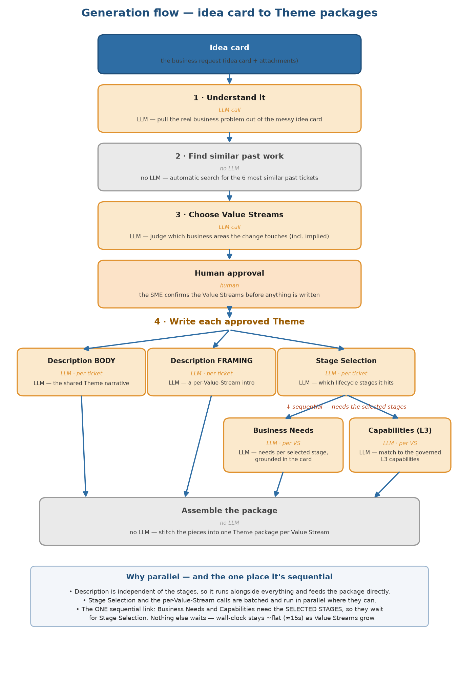

# Generation flow — idea card to Theme packages

## The steps

| # | step | LLM? | what it does | why it needs (or doesn't need) an LLM |
|---|---|---|---|---|
| | **Idea card** | — | The business request (idea card + attachments). | input |
| 1 | **Understand it** | **LLM** | Read the idea card and pull out the real business problem, capability and key terms. | The idea card is messy free text; a keyword scan can't extract meaning. |
| 2 | **Find similar past work** | no | Find the 6 most similar past tickets as precedent. | "Find similar" is a search — done automatically, no LLM. |
| 3 | **Choose Value Streams** | **LLM** | Decide which business areas (Value Streams) the change touches. | Needs judgment — especially the *implied* areas a keyword rule would miss. |
| | **Human approval** | human | The SME confirms the Value Streams. | Nothing is written until a person approves. |
| 4 | **Write each approved Theme** | **LLM** | For each approved Value Stream, write the **stages**, **description**, **business needs** and **L2/L3 capabilities**. | This is the writing work the tool is replacing. |
| | **Assemble the package** | no | Stitch the pieces into the final Theme package for review. | Mechanical assembly — no LLM. |

## Inside step 4 — how the Theme is written (parallel vs sequential)

Writing a Theme is not one call — it's a few, and most of them run **at the same time**. The calls fall
into two bands:

**Ticket-level — 3 calls, run in parallel (independent of each other):**
- **Stage Selection** — which lifecycle stages the work hits, for *all* value streams in one batched call.
- **Description BODY** — the shared Theme narrative.
- **Description FRAMING** — a short per-value-stream intro, batched in one call.

These three don't depend on each other, so they fire together.

**Per value stream — 2 calls each, run in parallel (and fanned out across all the value streams):**
- **Business Needs** — the needs for each selected stage.
- **Capabilities (L3)** — the L3 capabilities the work exercises.

**The one sequential dependency.** Business Needs and Capabilities both need to know **which stages were
selected**, so they **wait for Stage Selection** to finish — that is the only place the flow is forced to
be sequential. Everything else overlaps.

## What each LLM call sends and gets back

Each call is one focused request. Some run **once for the whole ticket**, some run **once for all value
streams together (batched)**, and some run **once per value stream**. "Batched" is the key efficiency:
one call covers every value stream instead of one call each.

| call | how it runs | what we send in | what we get back |
|---|---|---|---|
| **Understand** (condense) | one call · per ticket | the idea-card text | a clean summary + the key business facts |
| **Choose Value Streams** | one call · per ticket | the idea-card text + all 50 Value Streams + the 6 similar past tickets | the chosen Value Streams, each with a reason |
| **Stage Selection** | **one batched call · all Value Streams at once** | the idea-card text + each Value Stream's candidate stages | the selected stages, grouped by Value Stream |
| **Description BODY** | one call · per ticket | the idea-card text | the shared Theme narrative |
| **Description FRAMING** | **one batched call · all Value Streams at once** | the idea-card text + the approved Value Streams | a short intro paragraph per Value Stream |
| **Business Needs** | one call · per Value Stream | the idea-card text + that Value Stream's selected stages | the Business Needs write-up for that Value Stream |
| **Capabilities (L3)** | one call · per Value Stream | the idea-card text + each selected stage's candidate L3 capabilities | the chosen L3 capabilities, per stage |

**Reading it:** the two **batched** calls (Stage Selection, Description Framing) handle *all* value
streams in a single request — that's why adding value streams doesn't multiply those calls. Only
**Business Needs** and **Capabilities** run once per value stream, because each one writes value-stream-
specific content. Every call is given only the idea-card text plus the governed options it must choose
from — it never invents stages or capabilities, it selects from the approved lists.

## Why there are several LLM calls (and why that's not brute force)

Each LLM call maps to **one decision a Business Architect would otherwise make manually** — understand
the ticket, choose the areas, then write each Theme. For **N** approved Value Streams a request makes a
small, fixed set of calls:

- **1** to understand the idea card,
- **1** to choose the Value Streams,
- a few to **write each approved Theme** (stages, description, needs and capabilities).

Everything else — finding similar past work, and assembling the final package — runs automatically with
no LLM. So the model is used **only where the work is judgment or writing**; the mechanical parts
deliberately stay code.

## How many LLM calls per ticket

A ticket makes a small, predictable number of calls — **5 fixed, plus 2 per approved Value Stream.**

| call | when it runs | how many |
|---|---|---|
| Understand (Condense) | once per ticket | 1 |
| Choose Value Streams | once per ticket | 1 |
| Stage Selection | once per ticket (batched — all Value Streams) | 1 |
| Description BODY | once per ticket | 1 |
| Description FRAMING | once per ticket (batched — all Value Streams) | 1 |
| Business Needs | once per approved Value Stream | N |
| Capabilities (L3) | once per approved Value Stream | N |
| **Total** | | **5 + 2N** |

| approved Value Streams (N) | total LLM calls |
|---:|---:|
| 1 | 7 |
| 3 | 11 |
| 10 | 25 |

The first **5 calls are fixed** no matter how many Value Streams are approved — the two batched calls
(Stage Selection, Description Framing) cover all of them in one request. Only **Business Needs** and
**Capabilities** add a call per Value Stream, because each writes Value-Stream-specific content.

## Cost per ticket (GPT-5-mini)

GPT-5-mini pricing: **$0.25 / 1M input tokens, $2.00 / 1M output tokens.** Input tokens are the
**measured average per call** — the raw idea-card text is capped at ~24k tokens, but most idea cards
are smaller (the measured sample averaged ~5–7k), so the average ticket sits well below the cap. For a
ticket with **10 approved Value Streams**:

| call | runs | input tokens (avg) | output tokens | cost |
|---|---|---:|---:|---:|
| Condense | 1 | 6,000 | 500 | $0.0025 |
| Choose Value Streams | 1 | 12,000 | 1,500 | $0.0060 |
| Stage Selection | 1 (batched) | 7,602 | 1,273 | $0.0044 |
| Description BODY + FRAMING | 2 | 10,304 | 1,706 | $0.0060 |
| Business Needs | 10 (per VS) | 55,200 | 15,670 | $0.0451 |
| Capabilities (L3) | 10 (per VS) | 58,470 | 6,990 | $0.0286 |
| **Total (average)** | | **149,576** | **27,639** | **$0.093** |

- **10 Value Streams: ~$0.09 per ticket (average)** — about **$9 per 100 tickets, $93 per 1,000.**
- **3 Value Streams: ~$0.04 per ticket (average)** — about **$4 per 100 tickets, $41 per 1,000.**

Only **Business Needs** and **Capabilities** scale with the number of Value Streams; the rest is fixed
per ticket.

### Worst case — full 24k idea card on every call

When a ticket's idea card fills the **full ~24k-token budget**, that 24k rides on **every** call
(input = 24k + the call's own candidates), so the input cost roughly doubles. For **10 Value Streams**:

| call | runs | input tokens | output tokens | cost |
|---|---|---:|---:|---:|
| Condense | 1 | 24,000 | 500 | $0.0070 |
| Choose Value Streams | 1 | 30,000 | 1,500 | $0.0105 |
| Stage Selection | 1 (batched) | 26,600 | 1,273 | $0.0092 |
| Description BODY + FRAMING | 2 | 48,400 | 1,706 | $0.0155 |
| Business Needs | 10 (per VS) | 245,200 | 15,670 | $0.0926 |
| Capabilities (L3) | 10 (per VS) | 248,500 | 6,990 | $0.0761 |
| **Total (24k worst case)** | | **622,700** | **27,639** | **$0.211** |

- **10 Value Streams (worst case): ~$0.21 per ticket** — about **$21 per 100 tickets, $211 per 1,000.**
- Roughly **2.3×** the average — the gap is entirely the raw idea-card text being **sent on every
  call**. That's why batching the per-VS calls (one instead of N) saves the most on large idea cards:
  fewer copies of the 24k raw text.
