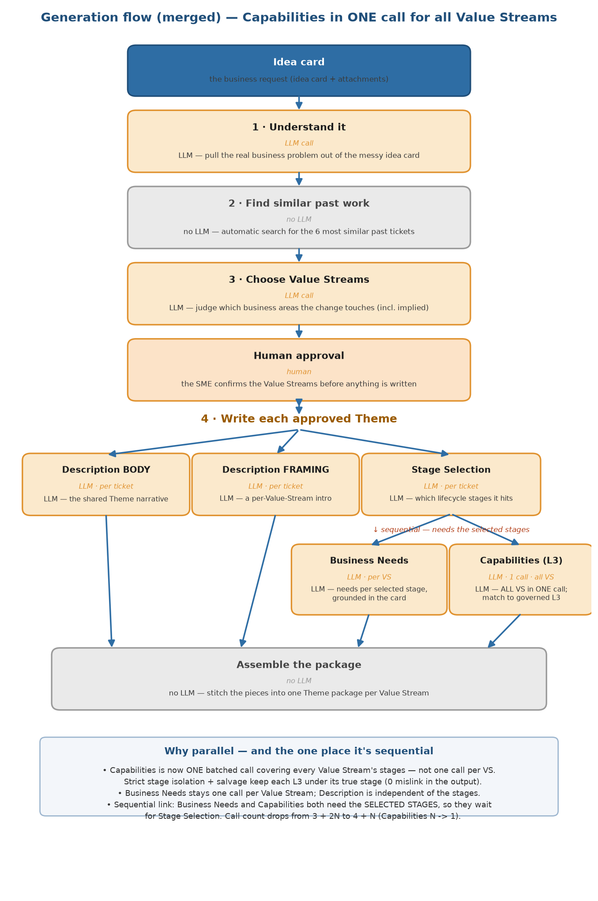

# Generation flow (merged variant) — Capabilities in one call for all Value Streams

A variant of the [generation flow](generation_flow.md) where **L2/L3 Capabilities** are produced by a
**single batched call covering every Value Stream's stages**, instead of one call per Value Stream.
Everything else is unchanged. This trades a little quality for fewer calls, lower input tokens, and
simpler orchestration.

## What changed

| | per-VS (current) | merged (this variant) |
|---|---|---|
| Capabilities (L3) | one call **per Value Stream** | **one call for ALL Value Streams** |

The merged call puts every Value Stream's selected stages — each with its own governed candidate L3 —
into one prompt. Candidates stay per-stage (strict isolation), and a deterministic salvage step
re-routes any L3 placed under the wrong stage to its true owner (a capability id belongs to exactly one
stage), so the **output is correct regardless**.

## Call count

For **N** approved Value Streams:

| | per-VS | merged |
|---|---|---|
| Capabilities calls | **N** | **1** |
| total LLM calls | **5 + 2N** | **6 + N** |
| at N = 3 | 11 | 9 |
| at N = 10 | 25 | **16** |

Capabilities collapses from N calls to 1, removing **N − 1** calls per ticket (9 at N = 10).

## Quality — measured (merged L3 eval, 118 tickets)

| metric | per-VS (one_call) | **merged (all VS)** |
|---|---|---|
| precision | 0.53 | **0.43** |
| recall | 0.90 | **0.84** |
| F1 | 0.67 | **0.57** |
| cross-stage/VS mislink (raw) | 5.1% | 17.0% |
| mislink **in the output** (after salvage) | **0** | **0** |
| hallucinated ids | 0.0% | **0.0%** |

- **Recall drops ~6 points** (0.90 → 0.84) — the real cost; one big prompt spreads attention thinner.
- **Precision drops ~10 points** strict, but a pick-relevance judge showed only **~18% of the non-GT
  picks are genuinely irrelevant** — the rest is plausible capabilities the ground truth didn't tag
  (under-tagging), so the *real* precision gap is much smaller.
- **Mislink looks worse (17% vs 5% raw) but is 0 in the delivered output either way** — salvage fixes
  it. Nothing is hallucinated.

## Cost (GPT-5-mini: $0.25/1M in, $2.00/1M out; average tokens)

Capabilities only:

| | per-VS | merged |
|---|---|---|
| calls | 10 | 1 |
| input tokens | 58,470 | ~14,500 |
| output tokens | 6,990 | 6,990 |
| **capabilities cost / ticket (10 VS)** | **$0.0286** | **$0.0176** |

The **output tokens are the same** (you still generate the same L3, just in one response — that's the
expensive $2/1M side), so the saving is on **input**: the raw idea-card text is sent **once** instead
of 10 times. **Capabilities cost drops ~38% (~$0.011/ticket)** at average idea-card size — and **more on
large idea cards**, where the per-call 24k raw text dominates (9 fewer copies of up to 24k tokens).

Per-ticket total (10 VS, average tokens): **~$0.093 → ~$0.082**.

## Latency (measured)

| | per-VS (one_call) | merged |
|---|---|---|
| unit | per Value Stream | per ticket (1 call) |
| avg / median | 4.4s / 4.0s | 10.9s / **6.4s** |

- Merged is **one ~6.4s call** vs N per-VS calls. If you run the per-VS calls **in parallel**, wall-clock
  is ~4.4s — so merged is slightly slower on the clock but **1 call instead of N**. If they ran
  sequentially, merged is far faster (6.4s vs 10×4.4s).
- The slow tail (≈5% of tickets over 30s, max 160s) is **concurrency-induced queueing**, not the model —
  big idea cards + concurrent load. Size timeouts for the p95 (~35s), not the average.

## Verdict

Merged Capabilities is a **fair trade, not free**:

- **Wins:** N → 1 calls (9 fewer at N=10), ~38% lower Capabilities input cost (more on big cards),
  simpler orchestration, less rate-limit exposure. 0 mislink in output, 0 hallucination.
- **Cost:** ~6 pts recall, ~10 pts strict precision (much of it under-tagging, not real error), and a
  ~5% slow-call tail to size timeouts around.

**Use merged** when call-count / cost / rate-limits matter and the architect reviews the output anyway.
**Keep per-VS** when maximum L3 recall is the priority.

---

## Business Needs — batched was tested too, and it does NOT hold

We also batched Business Needs (chunking 2 Value Streams per call, `--mode batched --chunk-size 2`).
Unlike Capabilities (short *selection*), Business Needs is long-form *writing* — and batching makes the
model ration its output, writing **shorter, less-grounded docs**. The quality drops materially:

| metric | per-VS | batched (chunk 2) |
|---|---|---|
| faithfulness | 0.895 | **0.715** |
| hallucination | 0.105 | **0.285** |
| coverage | 0.810 | **0.519** |

**Why:** the batched call emits **~920 output tokens per VS vs 1,567 per-VS** — each document is ~40%
shorter, so it reflects fewer source facts (coverage 0.52) and grounds fewer claims (hallucination
0.28). The shorter output is the direct cause of the quality loss. *(Caveat: the per-VS numbers used an
earlier 2-call judge, so part of the faithfulness gap is the stricter new judge — but the coverage drop
and the ~40% shorter output are hard evidence batching itself hurts.)*

**What it saves (N = 10):**

| | per-VS | batched (chunk 2) |
|---|---:|---:|
| LLM calls | 10 | **5** |
| input tokens | 55,200 | **28,870** |
| output tokens | 15,670 | 9,205 |
| cost / ticket | $0.0451 | $0.0256 |

Saves **5 calls (50%)**, **~26k input tokens (48%)**, ~$0.02/ticket. But the lower output is the
shorter docs, not a free win.

**Verdict: keep Business Needs per-VS.** The call/token saving is real, but it comes by making a
prescriptive, architect-facing artifact shorter and less grounded — a bad trade. Batch **Capabilities**
(short selection, holds up), not **Business Needs** (long writing, degrades).
