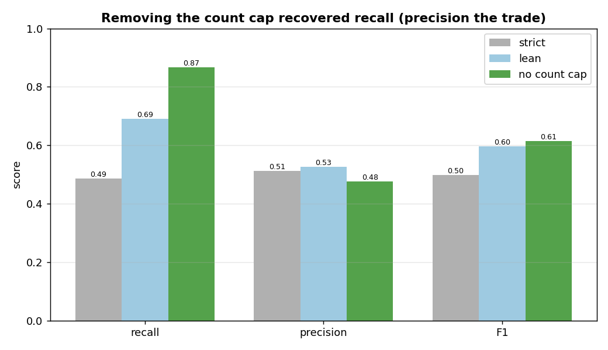
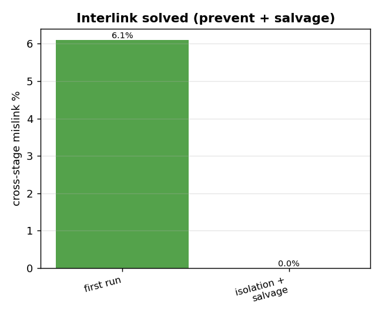
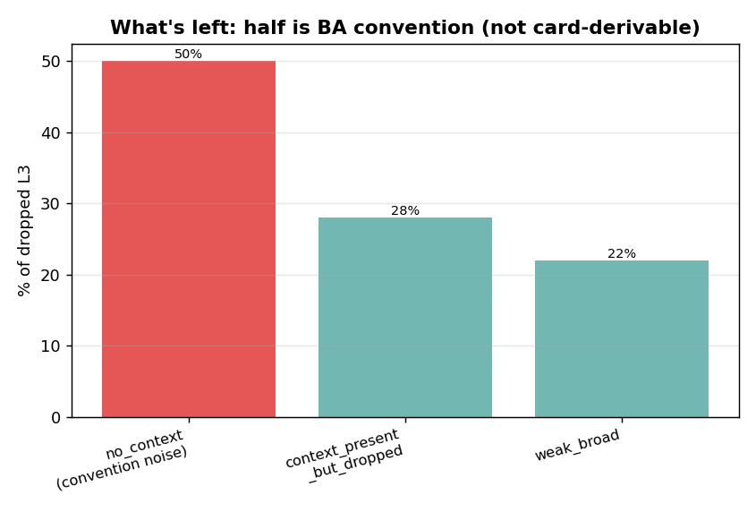

# L3 capability selection — EDA

**Question:** for the selected stages of an approved value stream, does the model pick the right
**L3 business capabilities** — and where does it fail?

## Task — classification, one level below stages

L3 selection mirrors stage selection one level deeper: for **each selected stage**, choose which of
that stage's **governed L3 capabilities** the idea exercises. The model picks only from that stage's
own candidate list (never invents, renames, or borrows across stages). It's the **finest-grained**
classification in the pipeline (L3 within stages within value streams).

## Setup

- **GT** = the Theme's `L3 Business Capability Model` field (`CAP#####` ids), recorded at the **theme
  level** (not per stage).
- Generation is **per stage** (raw idea card only, no signals — the locked theme-gen decision), so we
  **aggregate** the generated L3 across the value stream's GT stages into a theme-level set and score
  it against the GT theme set.
- **Two modes**, like stages: `per_stage` (one call per stage) vs `one_call` (batched — production).
- Sample: 25 tickets, seed 13, ~231 scored value streams.

## The coverage ceiling — theme-vs-stage granularity (read first)

| | value |
|---|---|
| **GT L3 reachable from the GT stages** | **58%** |

GT L3 is tagged at the **theme** level, but the catalogue maps each L3 to a **specific stage**. So
**42% of theme GT L3 belong to stages outside the selection** and can't be predicted from the GT
stages' candidate lists. We therefore **score only the answerable subset** (`theme GT L3 ∩ the GT
stages' candidates`) — the real model recall — and report this 58% separately as the **ceiling**. It
is a GT/granularity mismatch, not a model failure.

---

## Finding 1 — the count cap was suppressing recall (the big lever)

The first run was poor: **one_call F1 0.50, recall 0.49.** The drop diagnosis showed **49% of dropped
answerable GT L3 were `context_present_but_dropped`** — the card supports them, the model saw them,
and dropped them anyway. Cause: the prompt's soft cap (*"typically 1-4 per stage"*). When a stage's
GT has more than that, the model stays "in range" and drops card-supported capabilities — the same
*count-is-the-lever* pattern found in value-stream selection.

**one_call across the prompt versions:**

| version | precision | recall | F1 |
|---|---|---|---|
| strict (`default EXCLUDE, require exact phrase`) | 0.513 | 0.486 | 0.499 |
| lean (`include what the work exercises`) | 0.526 | 0.691 | 0.597 |
| **no count cap** (`include EVERY capability, no quota`) | 0.476 | **0.867** | **0.615** |

Removing the cap lifted **recall 0.49 → 0.87** — a large recovery, with precision trading down to
~0.48 (the cap had been suppressing some false positives too). F1 net **+0.12**. The
`context_present_but_dropped` bucket **halved (49% → 28%)**, confirming the cap was the cause.

## Finding 2 — interlink solved: prevent + salvage → 0

The batched call can put an L3 under the wrong stage (cross-stage mislink) — 6.1% at first. Two
layers fixed it:
- **Prevent (prompt):** a strict-isolation block — *check the exact id is printed under THAT stage's
  list; similar-named capabilities exist under several stages, use only the printed id.*
- **Salvage (code):** a capability id is governed by exactly one stage, so a mislinked pick is
  **reassigned to its true owner stage** instead of dropped.

Result: **cross-stage mislink 6.1% → 0%.** The prompt prevented it; the salvage net recovers any that
ever slip through (and recovers the mislinked-but-valid L3 into the prediction rather than losing it).

## Finding 3 — what's left is mostly BA convention, not a model gap

After the recall fix, the remaining drops (127 answerable GT L3) split as:

| grounding | share | meaning |
|---|---|---|
| **no_context_for_capability** | **50%** | the card has no evidence — the BA tagged it by capability-model convention (label noise, not derivable) |
| context_present_but_dropped | 28% | card supports it, dropped anyway — the residual fixable bit |
| weak_broad_context | 22% | borderline |

So **half the remaining drops are un-derivable from the ticket** (BA convention), and the fixable bit
shrank to 28%. Pushing recall further would keep trading precision for diminishing, convention-capped
gains — recall is **topped at the right place**.

---

## Verdict — locked

**L3 capability selection (answerable): F1 ≈ 0.62, recall ≈ 0.87, precision ≈ 0.48, on a 58% coverage
ceiling (theme-vs-stage granularity), 0% cross-stage mislink.**

- It's the **finest-grained** classification in the pipeline, against **theme-level GT** that doesn't
  decompose to stages — so the 58% coverage is a structural ceiling, and we score the answerable L3.
- **Removing the count cap was the lever** — recall 0.49 → 0.87 (the *count-is-the-lever* pattern
  again); precision is the accepted trade.
- **Interlink solved** — strict-isolation prompt (prevent) + salvage (correct) → 0% mislink.
- The residual gap is **mostly BA capability-model convention** (50% no-context) the card can't
  derive, plus a small fixable tail.

**No further changes.**
