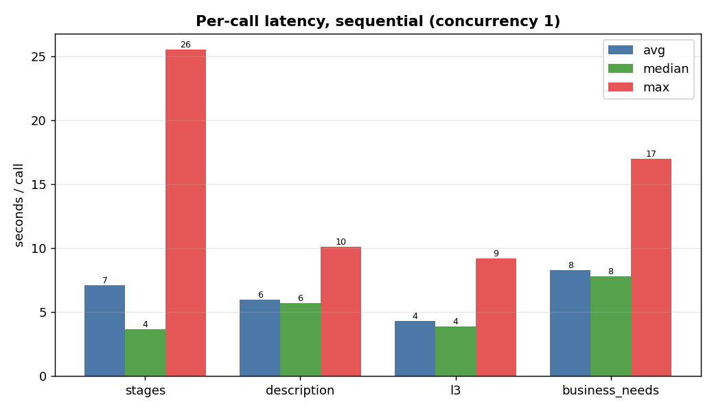
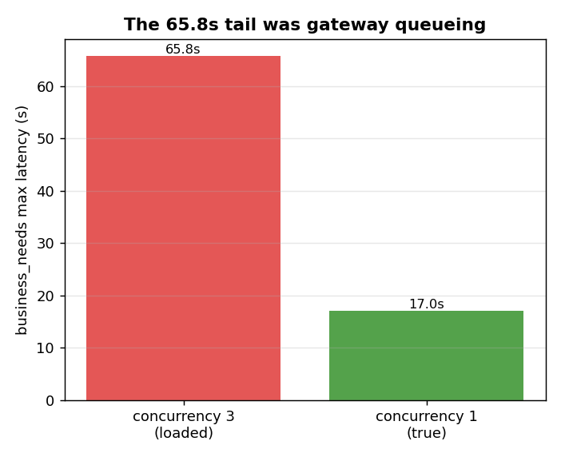
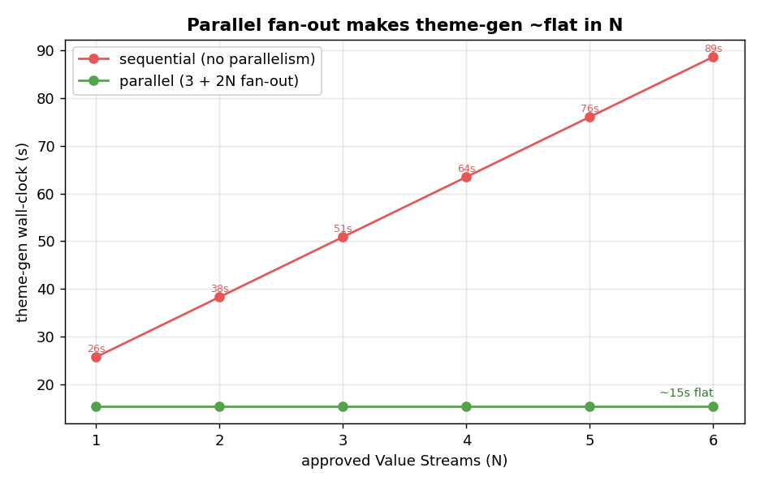
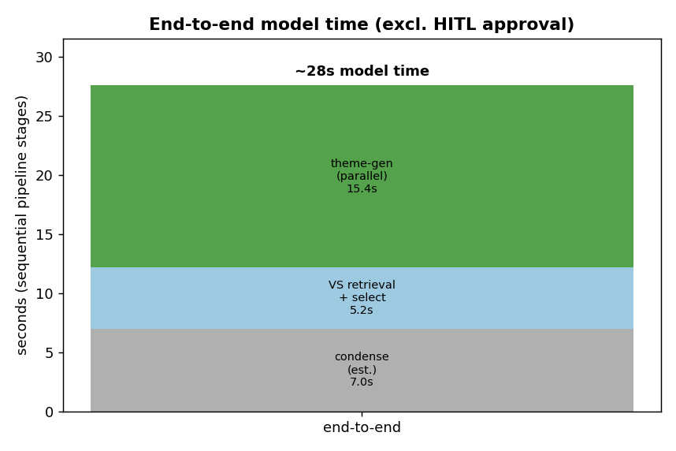

# Latency & cost — EDA

**Question:** how long does theme generation take per component, what does it cost in tokens, and —
with the production parallel call topology — how long does the **complete flow** take end to end?

## Setup

- Measured by `scripts/measure_costs.py` on **25 tickets** (seed 13, **raw idea-card text only**, no
  retrieval, no judges). Each component uses its **own** LLM client, so token counts are isolated.
- Two runs: **`--concurrency 3`** (the gateway under load, several calls in flight) and
  **`--concurrency 1`** (one call at a time — the **true per-call** latency, no queueing).
- Latency unit is **per ticket** (stages, description) or **per Value Stream** (l3, business_needs).
  Tokens are **per LLM call**.
- Value-Stream **retrieval + selection** latency is measured separately by `eval_vs` (the winning
  *evidence* config): **avg 5.2s / median 5.2s / max 8.2s** per ticket.

---

## Finding 1 — the true per-call latency (sequential, concurrency 1)



| component | unit | n | avg | median | max | avg tok | in | out |
|---|---|---:|---:|---:|---:|---:|---:|---:|
| stages | ticket | 25 | 7.1s | 3.7s | 25.5s | 8874 | 7602 | 1273 |
| description (body+framing) | ticket | 25 | 6.0s | 5.7s | 10.1s | 6006 | 5152 | 853 |
| l3 | VS | 95 | 4.3s | 3.9s | 9.2s | 6546 | 5847 | 699 |
| **business_needs** | VS | 95 | **8.3s** | **7.8s** | 17.0s | 7086 | 5520 | **1567** |

- **business_needs is the slowest component**, and it's legitimate, not a bug: it generates the most
  output (avg **1567 completion tokens** — nearly 2× any other). More tokens to emit = more wall time.
- **stages** has a low median (3.7s) but a high avg/max — a few multi-VS tickets with big candidate
  lists pull the tail up (input-heavy: 7602 prompt tokens).
- Token cost per ticket is dominated by **input** (raw ~24k-token idea card, packed): every component
  re-reads the raw text, so prompt tokens (5–8k) dwarf completion tokens (0.7–1.6k).

## Finding 2 — the 65.8s "business_needs" spike was gateway queueing, not the call



The earlier `--concurrency 3` run showed a **65.8s** business_needs max. `generate_business_needs`
makes **exactly one** LLM call per VS — there are no sequential sub-calls to blame. Re-running at
**`--concurrency 1`** collapsed that max to **17.0s**:

| | concurrency 3 (loaded) | concurrency 1 (true) |
|---|---:|---:|
| business_needs **max** | 65.8s | **17.0s** |
| business_needs median | 7.9s | 7.8s |

The **median barely moved** (7.9 → 7.8s) — only the *max* collapsed. So the 65.8s was one unlucky call
sitting behind others on the gateway while 3 tickets × 4 components fired at once. **The real per-call
cost is the ~8s median.** Important corollary: piling on *more* concurrency would *worsen* tails, not
help — the spike was caused by concurrent load, not a lack of it.

---

## Finding 3 — with parallel calls, the complete theme-gen flow is ~flat in N

The production topology (§6.1 of the TDD) is **3 + 2N** calls for N approved Value Streams:

- **Ticket-level band (run once, in parallel):** description BODY, description FRAMING, stage selection.
- **Per-VS band (fan out in parallel across all N VSs, 2 calls each):** business_needs, capabilities (l3).
  These wait only on **stage selection** (they need the selected stages).

So the critical path is **stage selection → max(business_needs, l3)**, and the per-VS band runs
concurrently across all N VSs:

```
critical path  =  stage_selection                         (gates the per-VS band)
               +  max(business_needs, l3)                  (per VS, fanned out in parallel)
               ≈  7.1s + max(8.3s, 4.3s)  =  7.1 + 8.3  ≈  15.4s   (avg)
               ≈  3.7s + max(7.8s, 3.9s)  =  3.7 + 7.8  ≈  11.5s   (median)
```

Description (body+framing, 6.0s) overlaps fully inside the stage-selection window and the theme-package
assembly is deterministic, so neither is on the critical path.



| approved VS (N) | sequential (no parallelism) | **parallel (3 + 2N)** |
|---:|---:|---:|
| 1 | 25.7s | **~15s** |
| 3 | 50.9s | **~15s** |
| 6 | 88.7s | **~15s** |

> Sequential cost grows as `13.1 + 12.6·N`; the parallel critical path is **~15s regardless of N**,
> because the per-VS calls fan out concurrently. For a typical 3-VS ticket that's **~51s → ~15s.**

**Caveat (the honest floor).** ~15s is an *idealized* floor that assumes the gateway serves the fan-out
without queueing. A 6-VS ticket fires **12** per-VS calls at once — and Finding 2 showed concurrent load
inflates tails. So in practice expect a band: **~15s for small N (1–3 VS); ~15–25s for larger N** as
gateway concurrency limits add queueing. The win over sequential is still large either way.

---

## Finding 4 — end-to-end model time (the complete flow)

The pipeline stages are inherently **sequential** (each needs the previous), with a human approval gate
before theme generation:



| stage | latency | source |
|---|---:|---|
| Condense (1 call after dropping signals) | ~7s *(estimate)* | comparable-size call; not yet measured standalone |
| VS retrieval + selection | 5.2s | measured (`eval_vs`, evidence run, median) |
| *— HITL approval —* | *human, unbounded* | excluded from model time |
| Theme generation (parallel) | ~15s | this EDA, Finding 3 |
| **End-to-end model time** | **~27s** | excl. human approval |

So the **complete flow is ~27s of model time** (condense → VS select → theme generation), plus whatever
the human review gate adds. Theme generation — the most expensive phase — is held to ~15s by the
parallel fan-out instead of ~50s+ sequential.

> The condense number is an **estimate** (condense fires the summary + signals passes in parallel via
> `asyncio.gather`, so its wall-clock is one call; with signals being dropped it's a single ~24k-token
> summary call, comparable to the description body at ~6s). Replace with a measured value when condense
> is instrumented the same way.

---

## Verdict

- **True per-call latency** (concurrency 1): stages 7.1s, description 6.0s, l3 4.3s, **business_needs
  8.3s** — business_needs is slowest because it emits the most tokens (1567 completion), not from any
  sequential sub-call.
- **The 65.8s spike was gateway queueing**, not the business_needs call — it collapses to 17.0s max /
  7.8s median when serialized. More parallelism worsens tails; it doesn't cause them.
- **Parallel fan-out (3 + 2N) makes theme generation ~15s regardless of N** (vs `13.1 + 12.6·N`
  sequential — e.g. ~51s → ~15s at 3 VS). Realistic band ~15–25s for large N due to gateway queueing.
- **Complete flow ≈ 27s of model time** end to end (condense ~7s est + VS select 5.2s + theme-gen
  ~15s), excluding the human approval gate.
