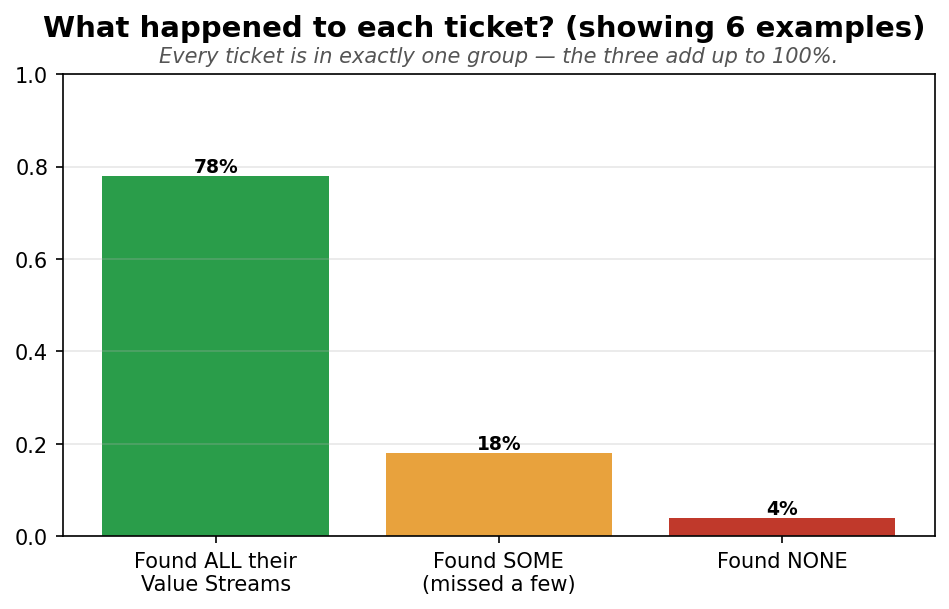
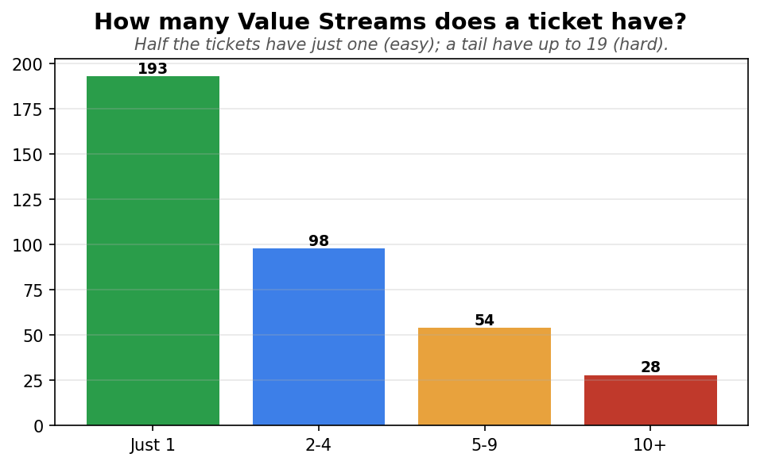
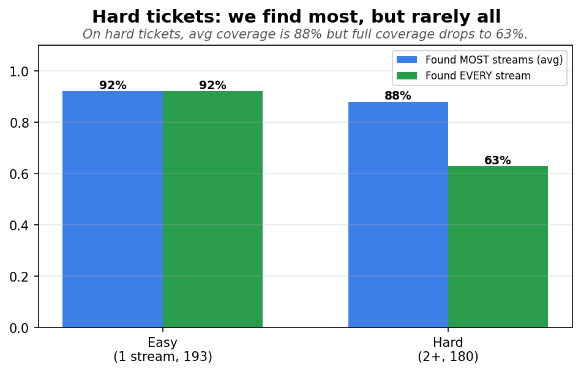
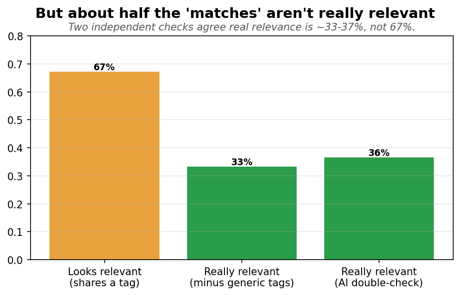
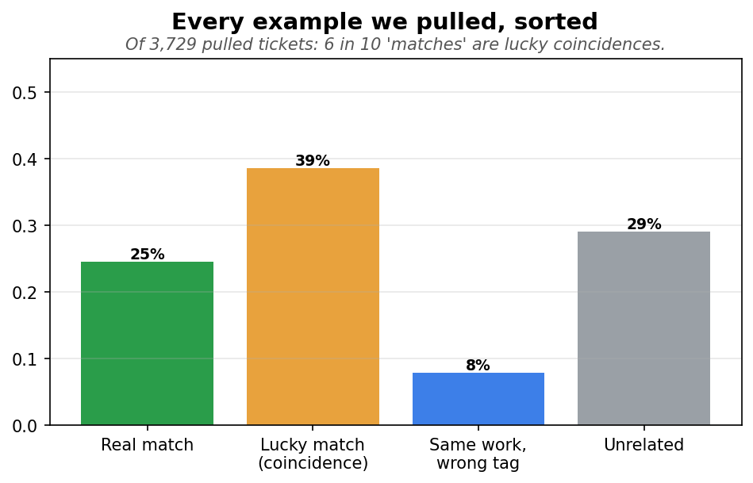
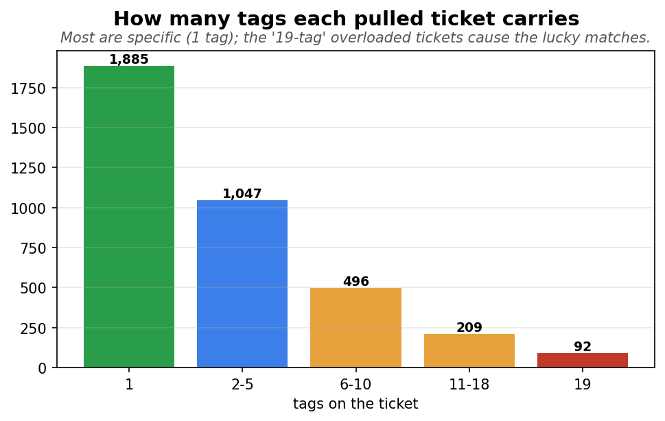
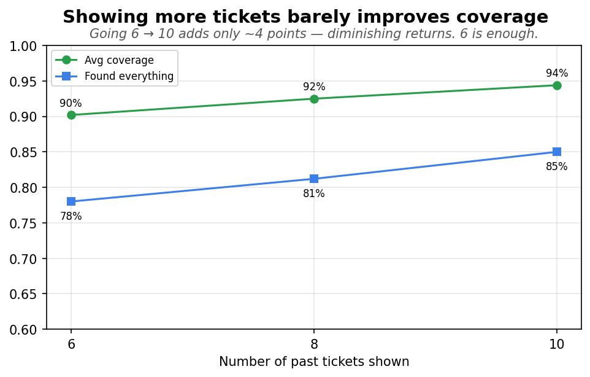
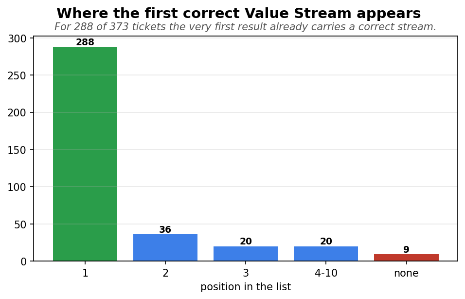

# How good is our “similar past tickets” search?

*A plain-language report. We tested the search on **373 real tickets**. For each one, the system pulls
the most similar past tickets and shows them to the model as examples ("here's what was done before").
This checks whether those examples are actually any good.*

**How we judge an example.** A pulled past ticket counts as a *match* if it carries one of the same
**Value Streams** the current ticket should have. We also had an **AI reviewer** read each pulled
ticket and say whether it's *genuinely about the same kind of work* — a second opinion that catches
matches that look right on paper but aren't.

> Throughout, **"@6"** means *"when we show the top 6 pulled past tickets."*

---

## Bottom line

- The search is **great at finding** the right examples — the correct Value Stream shows up for **90%**
  of tickets, usually as the **very first** result.
- But **about half** of what it calls a "match" only matches **by coincidence** — two independent
  checks (ignoring generic tags, and an AI reviewer) both say real relevance is **~33–37%**, not the
  **67%** a simple count suggests.
- The cause: **6 generic catch-all tags** + a tail of **"overloaded" tickets** tagged with up to **19**
  Value Streams that match almost anything.
- **Showing 6 past tickets is the sweet spot** — more dilutes the examples without really helping.
- **Worth fixing:** down-weight the generic tags and overloaded tickets when ranking — it sharpens
  relevance *and* helps cover the hard multi-stream tickets.

*Context:* **52%** of tickets belong to a single Value Stream (easy — one answer to find); **48%**
belong to two or more, a few to as many as **19** (hard).

---

## 1. It finds the right examples

When we show the 6 most similar past tickets, here's what happens to each of the 373 tickets — every
ticket lands in exactly one of three groups (so they add up to 100%):

**How to read it.** Each ticket has one or more correct Value Streams to find. Did the 6 examples
contain them?

- **Found ALL — 78%:** for 78% of tickets, *every* correct Value Stream was in the examples. Nothing
  missed. ✅
- **Found SOME — 18%:** found at least one, but missed a few. Usually the multi-stream tickets, where
  we catch the obvious streams and miss a long-tail one (see chart 3).
- **Found NONE — 4%:** the examples contained none of the correct streams — the only real misses.

So **96% of tickets find at least something** (the green + amber bars), and **78% find everything**.

> *One more number, measured differently:* averaged across tickets, a typical ticket has **90%** of its
> correct streams present in the examples. (That 90% is a per-ticket *average*, not a count of tickets —
> a ticket that finds 3 of its 4 streams contributes 75% to that average. The three bars above are
> ticket counts; the 90% is an average. Both say the same thing: coverage is strong.)

---

## 2. Not every ticket is equally hard

Half the tickets belong to a single Value Stream (easy — one answer to find); the other half belong to
several, a few to as many as 19 (hard). So the coverage numbers are an **average across easy and hard**
tickets.

**How to read it.** Each bar is *how many of the 373 tickets* have that many correct Value Streams:

- **Just 1 — 193 tickets (52%):** one right answer to find. Easy.
- **2–4 — 98 tickets**, **5–9 — 54**, **10+ — 28:** the more streams a ticket has, the harder it is to
  find them *all*. The 28 tickets with 10+ streams (a few have 19) are the truly hard cases.

So when you read "90% coverage," remember it's blended across these — the 52% single-stream tickets
are easy and lift the average.

---

## 3. Hard tickets: we find most, but rarely all

On hard (multi-stream) tickets the search still surfaces **88%** of the streams on average — almost as
good as the **92%** for easy tickets. But getting *every* stream right happens only **63%** of the time
(vs 92% for easy). In plain terms: on a hard ticket we catch the obvious streams and usually **miss one
or two from the long tail**.

**How to read it.** Two ticket groups (easy = 1 stream, hard = 2+), each measured two ways:

- **Blue — "Found MOST streams (avg)":** the average fraction of a ticket's streams that were found.
  Easy 92%, hard **88%** — nearly the same, so the search finds *most* of the answer even on hard tickets.
- **Green — "Found EVERY stream":** how often *all* streams were found. Easy 92%, hard **63%** — a big
  drop.

For **easy** tickets the two bars are identical (there's only one stream, so "most" and "every" are the
same). For **hard** tickets the gap between 88% and 63% is the story: we usually get *most* streams but
miss the last one or two.

---

## 4. But “relevant” is overcounted (the important catch)

If we just count "shares a tag," **67%** of pulled tickets look relevant. That's misleading: removing
the 6 generic tags drops it to **33%**, and an AI reviewer reading the actual text puts it at **37%**.
A simple rule and an AI **independently land in the same place** — real relevance is about half the
headline.

**How to read it.** Three ways of measuring *"of the tickets we pulled, how many are actually relevant?"*

- **Looks relevant — 67%** *(amber, flattering):* counts any ticket that shares a tag. Easy to inflate.
- **Minus generic tags — 33%** *(green):* same count, but a shared *generic* tag (one that's on tons of
  tickets) doesn't count. A simple rule.
- **AI double-check — 37%** *(green):* an AI read the actual text and judged real similarity. Independent
  of tags entirely.

The point: the two honest measures (33% and 37%) **agree with each other** and both sit at about *half*
of the flattering 67%. When a rule and an AI reach the same answer two different ways, you can trust it.

---

## 5. Every example we pulled, sorted

Splitting all **3,729** pulled tickets four ways: only **24%** are real matches (right tag *and* same
work), **39%** are lucky matches (right tag, different work), **8%** are the same work tagged
differently, and **29%** are unrelated. So **6 in 10 "matches" are coincidences**.

**How to read it.** Every pulled ticket falls into exactly one bucket, based on two yes/no questions —
*does it share a tag?* and *did the AI say it's really similar?*

- **Real match — 24%:** shares a tag **and** AI says same work. Genuine precedent. ✅
- **Lucky match — 39%:** shares a tag **but** AI says different work. A coincidence. ⚠️
- **Same work, wrong tag — 8%:** AI says similar **but** no shared tag — a labeling gap, not a search miss.
- **Unrelated — 29%:** neither.

The two "shares a tag" bars (Real + Lucky = 24% + 39% = 63%) are what the flattering "67% relevant"
counts — and **most of it (39 of 63) is the lucky bucket**.

---

## 6. Why the lucky matches happen

Most pulled tickets are specific (a single tag). But a tail of **"overloaded"** tickets carry up to
**19 tags each** — those match almost any query by accident. Combined with the 6 generic catch-all
tags, they create the coincidental matches.

**How to read it.** Each bar is *how many pulled tickets* carry that many tags:

- **1 tag — 1,885:** most pulled tickets are specific — a clean, single-purpose ticket. Good.
- **2–10 tags — ~1,500:** moderate.
- **19 tags — 92:** these "overloaded" tickets carry 19 Value Streams each. A ticket tagged with 19
  things will *share a tag* with almost any query — pure coincidence. These are the lucky-match machines.

This is the mechanism behind chart 5's lucky bucket.

---

## 7. More examples is *not* better

Showing 6, 8, or 10 past tickets: more finds slightly more right answers but a steady share of the
extras are junk — a near **1-for-1 trade**. **6 is the sweet spot.**

**How to read it.** The x-axis is *how many past tickets we show* (6, 8, 10). Three lines:

- **Green — Coverage** *(climbs):* showing more tickets finds slightly more right answers (90% → 94%).
- **Amber — Looks relevant** *(drops):* but the extra tickets are less on-target, so relevance falls
  (67% → 63%).
- **Blue dashed — Really relevant (AI)** *(drops):* the honest relevance also falls (37% → 32%).

Going up in K gains a little coverage and loses about the same in relevance — a wash. So we stop at 6.

---

## 8. The first useful example is usually right at the top

For **288 of 373** tickets the #1 result is already useful; only **9** tickets found nothing relevant
at all. The ranking puts good examples first — though the underlying scores barely separate good from
bad (0.51 vs 0.48), so we rely on the *ordering*, not the score size.

**How to read it.** Each bar is *how many tickets* had their first useful example at that position:

- **Position 1 — 288 tickets:** for most tickets the very first result is already a hit. The ranking is
  good at putting the best example on top.
- **Positions 2, 3, 4–10 — small:** a few tickets need to look a little deeper.
- **None — 9 tickets:** no useful example was found at all (the only true retrieval failures).

A big spike at position 1 = the system rarely makes you dig for a good example.

---

## All the numbers

| Measure (per ticket) | Show 6 | Show 8 | Show 10 |
|---|---|---|---|
| Right answer found (coverage) | 90% | 92% | 94% |
| Found at least one useful | 96% | 97% | 98% |
| Found EVERY stream | 78% | 81% | 85% |
| Looks relevant | 67% | 65% | 63% |
| Really relevant (minus generic tags) | 33% | 31% | 30% |
| Really relevant (AI double-check) | 37% | 34% | 32% |
| First useful at the top (MRR) | 0.85 | 0.85 | 0.85 |

---

## Plain-language glossary

| Term | What it means |
|---|---|
| **Value Stream / tag** | The business category a ticket belongs to — what we predict. |
| **Coverage** | Did the correct Value Stream show up among the pulled examples. |
| **Looks relevant** | An example that shares a tag with the current ticket. |
| **Really relevant** | An example that's *actually about the same kind of work*, not just a shared tag. |
| **Lucky match** | Shares a tag by coincidence (usually a generic tag) but is different work. |
| **Generic / catch-all tag** | A Value Stream on a large share of tickets, so sharing it means little. |
| **Overloaded ticket** | A past ticket tagged with many Value Streams — matches almost anything. |
| **Easy / hard ticket** | Easy = 1 correct Value Stream; hard = 2 or more. |
| **@6 / @8 / @10** | When showing the top 6 / 8 / 10 pulled past tickets. |
