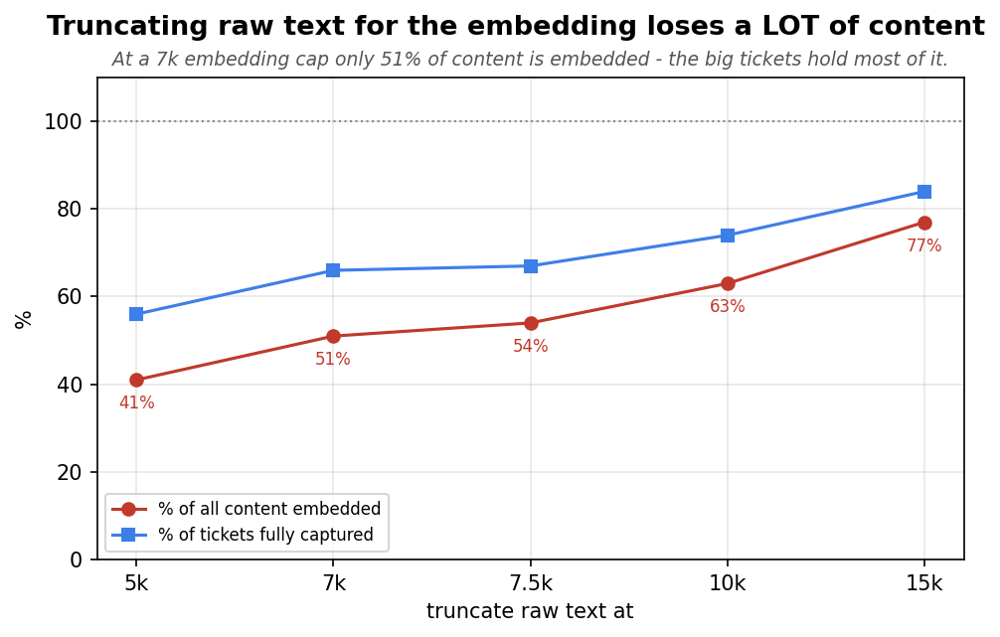
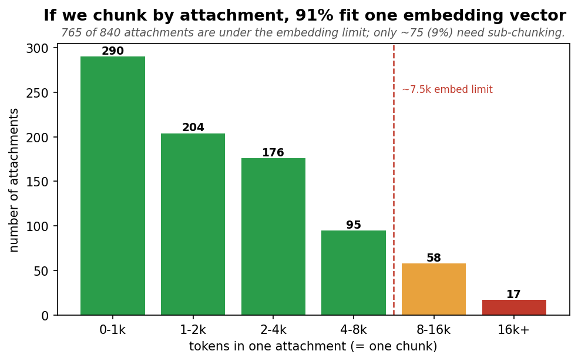

# Raw vs summary for retrieval — how should we represent a ticket for matching?

*We want to feed the model **raw ticket text** for prediction. But retrieval (finding similar past
tickets) works by **embedding** text into a vector and matching. This EDA answers: can we embed the
raw text, or do we still need the summary? Measured on **374 tickets**.*

---

## Bottom line

- **Raw text cannot be embedded directly.** The embedding model caps at **~7.5k tokens**; a typical
  ticket's raw text is bigger and the largest is ~89k. Feed it raw and it **silently keeps only the
  first ~7.5k** — about **51% of the content**, and it drops most of the *big* tickets.
- **The summary embeds the *whole* ticket** (~460 tokens, fully under the cap), so summary-based
  retrieval sees 100% of every ticket — it is a *better* embedding than truncated raw.
- **Decision: summary → find, raw → decide.** Keep **summary-based retrieval** (the constraint forces
  it, and it's already proven at 90% coverage); use **raw text in the prompt** (the part that doesn't
  go through the embedder).
- **Chunking** (multi-vector, one vector per attachment) is the only way to embed *all* raw content
  with no summary — but it costs ~3.6× the vectors and real retrieval complexity, and may not beat the
  summary. It's the documented Phase-2 fallback, not the first move.

---

## The hard constraint: the embedding cap

To retrieve, both the **query** and the **index documents** must be turned into vectors by the
embedding model — which only accepts **~7.5k tokens** (≈ 30k characters). Anything bigger is truncated
to the first 7.5k *before* it's embedded. This applies to:

- the **index side** (what we store to match against), and
- the **query side** (the incoming ticket we're predicting).

So "use raw text for matching" runs straight into this wall — you can't embed a 24k (or 89k) ticket.

---

## Option 1 — Summary (current, recommended)

The LLM summary is ~460 tokens — **comfortably under the cap**, and it distills the *entire* ticket
(including the big decks) into that one vector. So summary-based retrieval embeds **100% of every
ticket's gist**. It's what the proven 90%-coverage retrieval already uses.

**Cost:** one summarization LLM call per ticket (at ingest, and per query at prediction). That's the
only place summarization survives — it's gone from the *prompt*, kept for *matching*.

---

## Option 2 — Raw, truncated to the cap (lossy)

If we drop the summary and embed raw text truncated at the 7.5k cap:

**At a 7k cap, only 51% of all content is embedded** (66% of tickets fit fully, but the 34% that
overflow are the big tickets that hold most of the corpus's content). The matching signal is
front-loaded (the description is always kept), so it's not 51% *worse* — but it's strictly lossier
than the summary, which saw everything. **Raw-truncated is a downgrade from summary for retrieval.**

---

## Option 3 — Chunking (multi-vector, the Phase-2 fallback)

Chunk each ticket into pieces small enough to embed — one chunk per attachment (plus the description) —
and store a vector per chunk. Retrieval matches any chunk and rolls results up to the ticket. This
captures **100% of content with no summary and no truncation loss**.

The data says this is feasible: **91% of attachments (765 of 840) already fit one embedding vector**;
only ~9% (the big PDFs/decks) need sub-chunking. Total cost: **~1,340 vectors vs 374 single-vector
(≈3.6×)**.

**But the catch:** it adds real machinery — 3.6× embedding calls at ingest, chunk→ticket aggregation
on retrieval, multi-vector query handling — and it **may not beat the summary**, which already hits 90%
coverage and (per Option 2) is a richer embedding than truncated raw. So chunking is worth it only if
summary-based retrieval is shown to underperform. **Documented, not built.**

---

## The decision and the budget split

The embedding cap *forces* the split — it's not a preference:

| Stage | Limit | Representation | Why |
|---|---|---|---|
| **Retrieval (embedding)** | ~7.5k tokens (model cap) | **Summary** | whole ticket, fully embeddable, proven 90% |
| **Prompt (chat LLM)** | ~24k (our budget) | **Raw** | doesn't go through the embedder; full context to decide |

**"Summary to find, raw to decide."**

### Plumbing this implies
- The search index keeps **summary-based** `searchText` + VS labels (unchanged).
- The prompt's **query** input switches to the ticket's raw text.
- The prompt's **historic evidence** comes from a **Cosmos point-read by id** for each of the 6
  retrieved tickets (cheap on `/sourceId`); in the offline eval it's a local lookup in
  `cosmos_idmt.json`.

---

## The deciding experiment: is 7k raw "good enough" for everything?

There's a cleaner outcome hiding here. The summary→find / raw→decide split exists *only because* 24k
raw can't be embedded. But **7k raw *can* be embedded** (it fits the cap). So if 7k raw is good enough,
we store **one 7k raw text per ticket, no summary at all** — used for both matching and the prompt.

The cost is the 51% content loss (concentrated in the big multi-attachment tickets), so the risk is
worse accuracy on exactly the hard tickets. Two tests decide it:

| Test | Question | If it holds |
|---|---|---|
| **VS selection with a 7k raw query** | does prediction accuracy hold vs full-raw / summary? | the prompt can use 7k |
| **Retrieval with 7k raw embedding** | does coverage hold vs the summary's 90%? | matching can use 7k |

**Outcomes:**
- both hold → **drop the summary entirely**, store one 7k raw text (the cleanest result);
- selection holds, retrieval doesn't → keep summary for *matching only*, raw for the prompt;
- neither → full-raw prompt + summary retrieval (the split above).

## What's settled vs open

**Settled:** raw text cannot be embedded above ~7.5k, so retrieval needs a reduced representation
(summary, 7k-raw, or chunks) — never the full 24k.

**Open (the experiments, measured next):**
1. **Query representation for the prompt:** summary vs full-raw (24k) vs **7k-raw**.
2. **Historic representation in the prompt:** summary vs truncated-raw@K vs description (+ the K sweep).
3. **Retrieval representation:** summary (current 90%) vs **7k-raw embedding** — the test that decides
   whether summarization can be removed completely.
