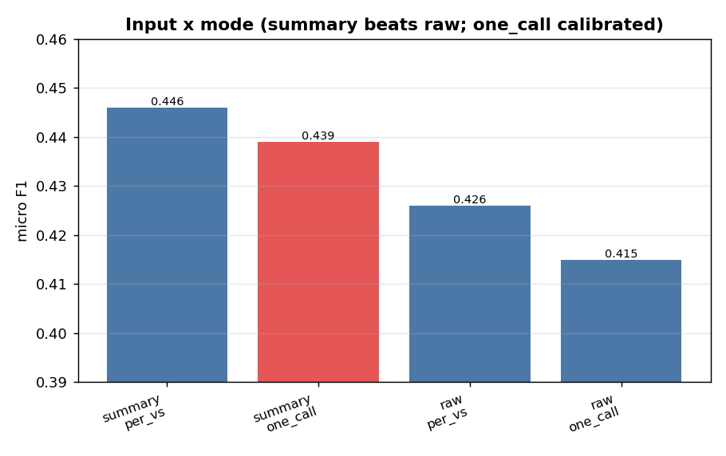
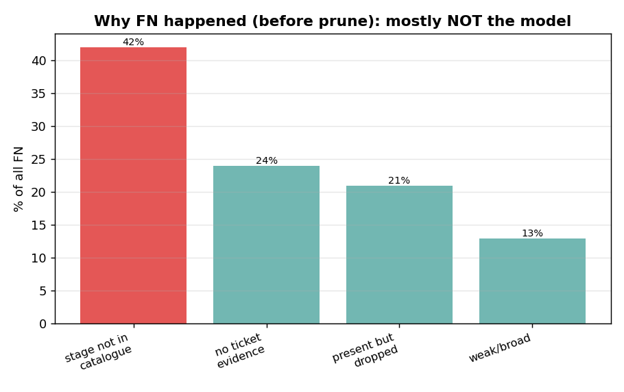
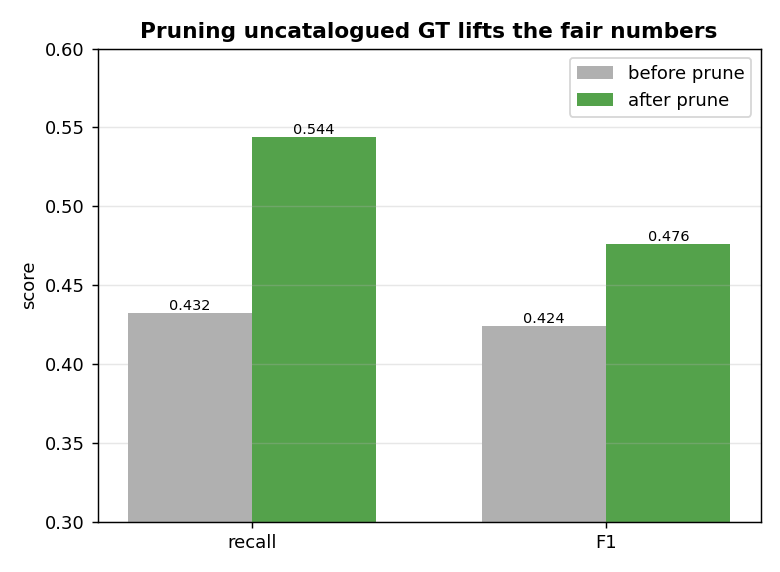
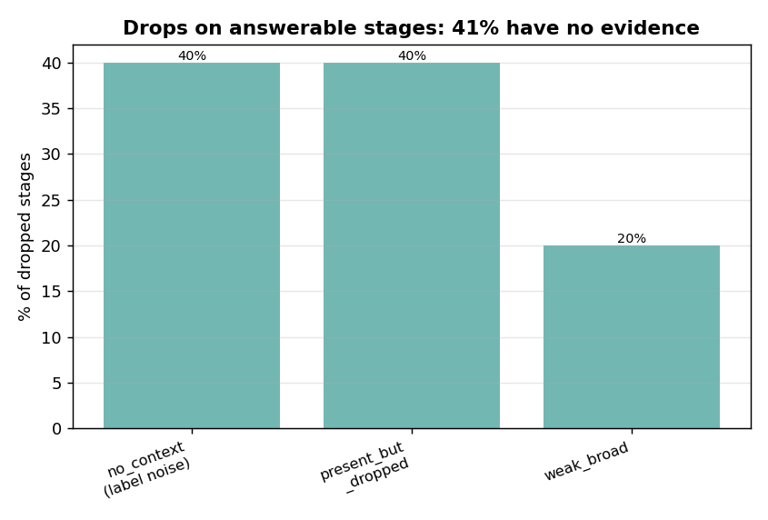
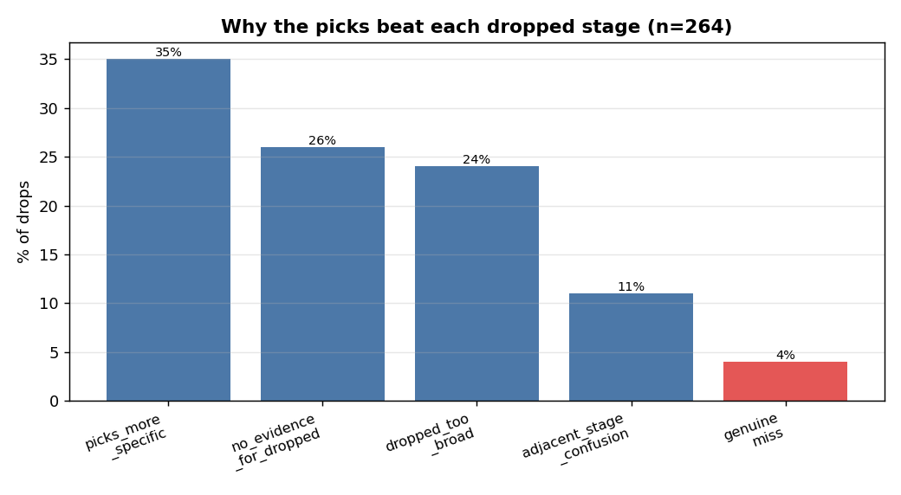
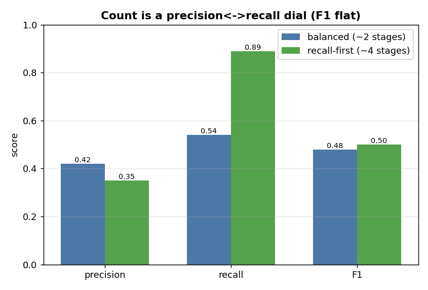

# Stage selection — EDA

**Question:** given an approved value stream, how well does the model pick the lifecycle **stages**
(Jira Epics) the idea card impacts — and where does it fail?

**Task (distinct from VS prediction):** VS prediction picks *which broad value streams* a change
touches. Stage selection is narrower: for **one already-approved value stream**, choose which of its
**5–15 governed lifecycle stages** the work falls into. The model picks only from that value stream's
own candidate stages — it cannot invent or borrow.

## Setup

- **GT** = the stages the BA actually tagged, read straight from each Epic's **Value Stream Stage**
  cascading field (`<vs> {vs_id} - <stage> {stage_id}`) — authoritative, not fuzzy title matching.
- **Cohort** = tickets with ≥3 value streams and ≥5 GT stages (the discriminating multi-VS cases),
  plus a full-population run. `count`-free: the model returns 1–3 stages per VS, the architect trims.
- **Two modes** compared: `per_vs` (one LLM call per value stream) and `one_call` (all value streams
  in one batched call — the production path).
- **Two inputs** compared: the stored **summary** vs the **raw** idea card.

## Terms

| term | meaning |
|---|---|
| **per_vs** | one LLM call per value stream (N calls for N value streams) |
| **one_call** | one batched call for every value stream at once (the production path) |
| **coverage** | share of GT stage ids that are actually IN the catalogue the model picks from — the recall ceiling |
| **mislink (cross_vs)** | a stage the batched call assigned to the WRONG value stream |
| **fallback** | the resolver returned the whole lifecycle (empty/invalid LLM pick) |

---

## Finding 1 — summary beats raw (the opposite of VS)

| input | mode | F1 |
|---|---|---|
| **summary** | **one_call** | **0.439** |
| summary | per_vs | 0.446 |
| raw | per_vs | 0.426 |
| raw | one_call | 0.415 |

**For stages, the summary wins** (by ~2 pts, consistent across modes, and it held after the raw input
was cleanly re-labelled `ideaCard` rather than framed as a summary). This is the **opposite of VS**,
where the full raw prompt won by ~7 pts. The reason: VS needs **breadth** (the implied/downstream
areas live in raw detail); stage selection is a **narrow action→stage match**, and the concise
summary already isolates the action — raw re-buries it in noise.

> **Raw to decide which VS · summary to decide which stages.** (Production still feeds raw for
> architectural consistency across theme generation; the cost is ~2 pts, well within the structural
> ceiling below — see Finding 5.)

## Finding 2 — one_call is the right mode (calibrated, not just cheap)

`per_vs` edges F1 by ~1.7 pts, but only by **over-fetching** (avg 2.6 picks vs 1.9 GT). `one_call`:
- is **calibrated** (predicts ≈ the right count),
- has **higher precision** and **near-zero fallback** (0.005),
- and is **1 call instead of N** (~6× cheaper on a 6-VS ticket).

So `one_call` is the production path; `per_vs`'s recall edge is just overfetch you'd pay N calls for.

## Finding 3 — interlinking solved (prevent + salvage)

The batched call can assign a stage to the wrong value stream (cross-VS mislink). Two layers fixed it:
- **Prevent** — a STRICT VALUE-STREAM ISOLATION block: candidate lists are disjoint, only return ids
  printed under THAT value stream.
- **Salvage** — a stage id is globally unique to one value stream, so a mislinked pick is reassigned
  to its true owner instead of being dropped (a safety net; ideally never used).

**Result: cross_vs mislinks went from 1–5 → 0.** The metric still records the model's raw behaviour,
so we know prevention is working, while output gets the corrected assignment.

---

## Finding 4 — the recall ceiling was a CATALOGUE gap, and fixing it lifted the fair numbers

The first runs showed recall ~0.43 against a **76% coverage** ceiling. Diagnosis (no LLM) split the
false negatives by cause:

- **~42% of FN: the GT stage id wasn't in the catalogue at all** — a valid `VSS#####` stage the BA
  tagged in Jira, but the catalogue export never listed it (e.g. *Determine Corrective Action*,
  *Train Provider*). The model **cannot pick what isn't an option.** It was *not* a VS-mapping issue —
  all 44 GT value streams were present; only specific stages were missing.
- **~24% of FN: the stage is a candidate but the ticket has no evidence for it** — the BA chose it
  from lifecycle convention / outside knowledge (label noise).
- ~21% present-but-dropped, ~13% weak/broad.

So **~66% of FN was NOT the model's fault** (un-pickable or un-derivable). The fix: **drop the
uncatalogued GT stages** (retired / out-of-catalogue) at extraction — the model can't be graded on
stages that aren't options.

| metric (raw / one_call) | before prune | after prune |
|---|---|---|
| recall | 0.432 | **0.544** |
| F1 | 0.424 | **0.476** |

Removing the ~18% un-pickable GT lifted recall **+0.11** and F1 **+0.05** — a pure data fix, zero
model change. The post-prune numbers are the **fair baseline**: the model against *answerable* GT.

## Finding 5 — what's left is mostly label noise + defensible narrow picks

On the answerable stages (post-prune), the drops break down as (n = 259 classified):

| grounding | count | share | meaning |
|---|---|---|---|
| **no_context_for_stage** | 105 | **40%** | no ticket evidence — the BA's outside-knowledge pick (label noise) |
| context_present_but_dropped | 103 | 40% | evidence shown, dropped anyway |
| weak_broad_context | 51 | 20% | borderline |

And *why* the picks won over each dropped stage (n = 264):

| reason | count | share | read |
|---|---|---|---|
| picks_more_specific | 94 | 35% | the model picked a **better/narrower** stage — often the model being right |
| no_evidence_for_dropped | 69 | 26% | nothing in the ticket points to the dropped stage |
| dropped_too_broad | 63 | 24% | the GT stage is broad/adjacent, only loosely implied |
| adjacent_stage_confusion | 28 | 11% | a neighbouring lifecycle stage picked instead (the one fixable lever) |
| **dropped_is_valid_should_have_picked** | **10** | **4%** | **genuine model misses** |

**So ~40% of drops are un-derivable from the ticket, most of the rest is the model making defensible
narrower picks, and only ~4% are genuine misses.** The one fixable lever — adjacent-stage confusion —
was already pushed down from 17% → 11% with a stage-boundary prompt (pick by entrance/exit scope, and
include both adjacent stages when the work spans a boundary).

## Finding — the count is a precision↔recall dial (and the GT may be under-tagged)

The model returns a stage count; how generous that is trades precision for recall. Removing the
prompt's count guidance entirely makes it a recall-first selector:

| config (one_call) | avg predicted | precision | recall | F1 |
|---|---|---|---|---|
| **balanced** (lean-but-bounded) | ~2.0 | **0.42** | 0.54 | 0.48 |
| **recall-first** (no count cap) | ~3.9 | 0.35 | **0.89** | 0.50 |

So the same dial seen in value-stream selection applies: the count is a lever, not a fixed answer.
**F1 is roughly flat** across the dial (0.48–0.50) — recall-first trades precision ~1:1 for recall.

**Crucially, the precision side is probably understated by the ground truth.** GT averages only
**1.56 stages per VS**, yet a single change often genuinely runs through more of a value stream's
lifecycle. The recall-first picks marked "false positives" against that thin GT are frequently
*plausible* stages the architect simply did not tag — the same pattern the value-stream judge showed
(many non-GT picks rated relevant). So the recall-first config's true precision is higher than 0.35;
the strict score penalises it for stages the BA under-tagged or prioritised differently.

**This is a product choice, not a bug:**
- **recall-first** (no cap) — surfaces every stage the work plausibly touches (~4), recall ~0.89; the
  architect trims. Best when missing a stage is worse than reviewing an extra.
- **precision-first** (bounded) — a tighter set (~2), recall ~0.54; less to trim. Best when a lean,
  high-confidence list is wanted.

Both sit at ~0.48–0.50 strict F1; the dial just moves where on the precision/recall curve you operate.

---

## Verdict — locked

**Stage selection: raw input + one_call, ~0.48–0.50 strict F1 with a precision↔recall dial
(precision-first ~2 stages / recall 0.54, or recall-first ~4 stages / recall 0.89), 0 mislinks.**

- **summary slightly beats raw** for stages (~2 pts), but production feeds **raw** for architectural
  consistency (one input across VS/stages/description/needs) — the cost is within the structural ceiling.
- **one_call** is the production mode: 1 call not N.
- **Interlinking is solved** (isolation prompt + salvage → 0 cross-VS mislinks).
- **The recall ceiling was a catalogue gap**, not the model — pruning uncatalogued GT lifted recall.
- **The count is a precision↔recall dial** — F1 is flat across it (~0.48–0.50); choose recall-first
  (surface all, architect trims) or precision-first (tight set) per product need. The low precision is
  partly real over-fetch and **partly thin/under-tagged GT** (1.56 stages/VS, while a change often
  touches more) — strict precision penalises plausible stages the BA didn't tag.
- **The remaining true gap is structural**: ~40% of drops have no ticket evidence (BA outside-knowledge
  picks), most of the rest is defensible selection, and only ~4% are genuine misses.

The model performs well against an answerable, noisy target. **No further changes.**
