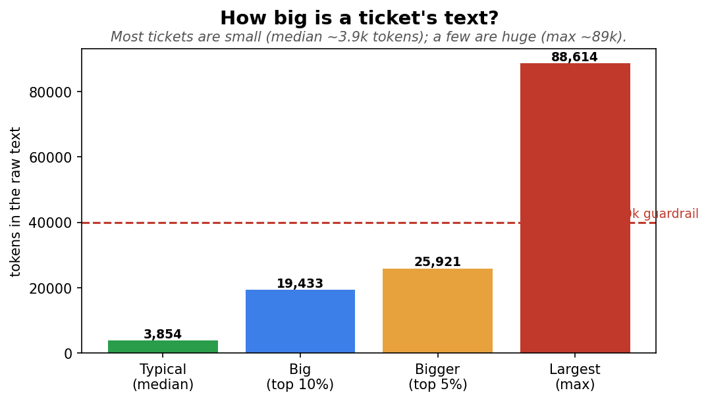
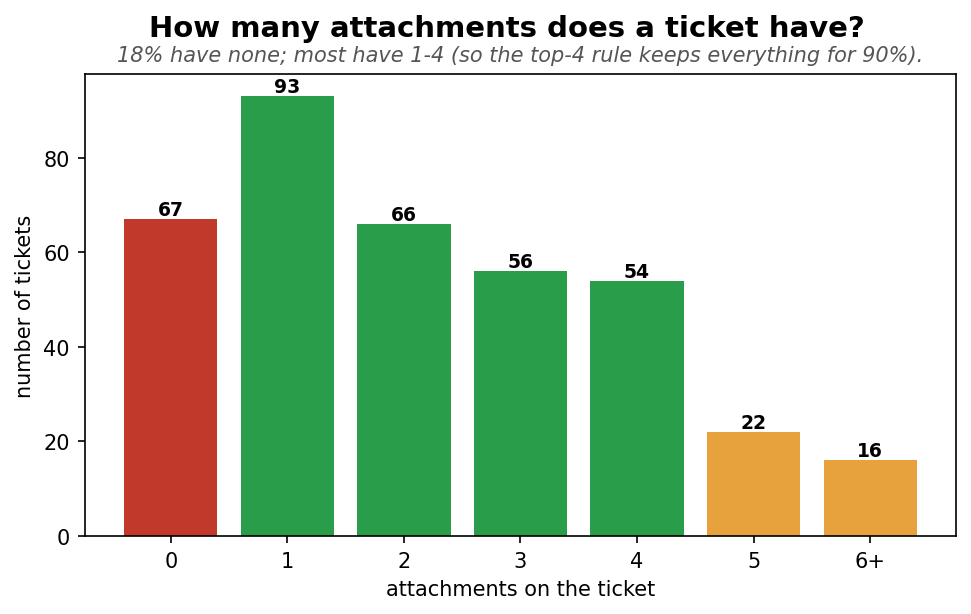
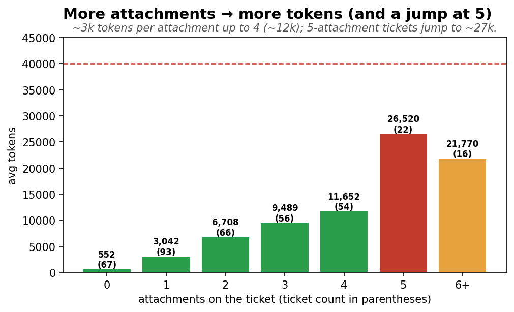
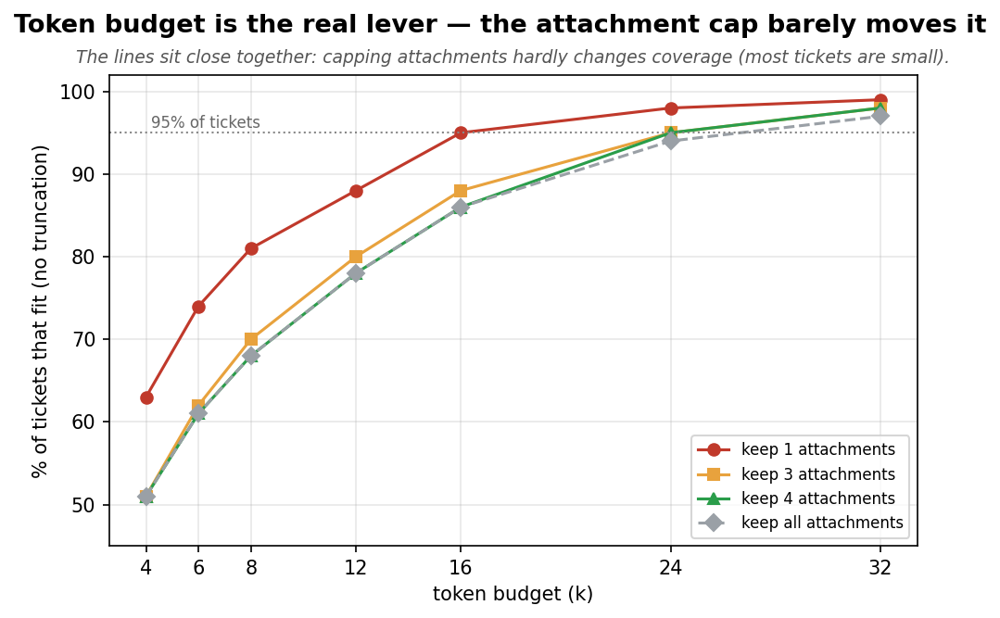
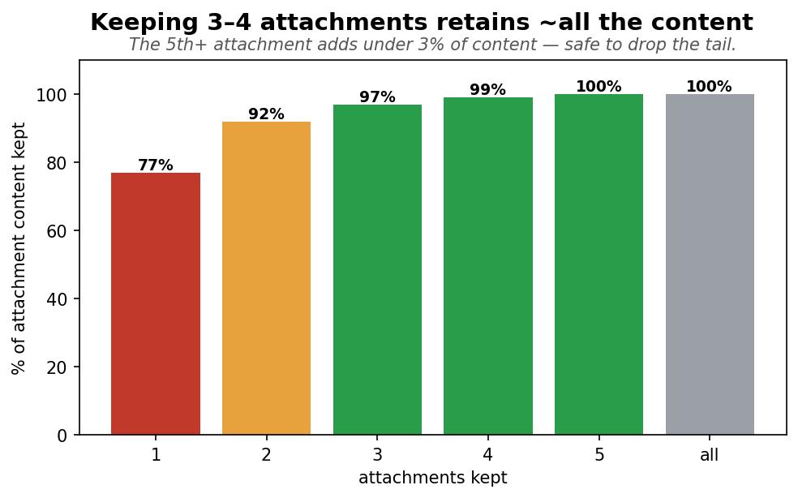

# Can we feed the model the raw ticket text — and how big should we let it get?

*Instead of an LLM-written summary, we want to give the model the **raw ticket text** (description +
attachments). This checks whether that's feasible, and works out **how many attachments to keep** and
**what token budget** to set. Measured on **374 tickets** (a token ≈ ¾ of a word; more tokens = slower
and costlier).*

---

## Bottom line

- **Raw text is feasible** — most tickets are small, and even the largest fits the model.
- **Most tickets are tiny:** the typical ticket's full text is **~3,854 tokens**. A few are huge
  (max ~89k), driven by big PowerPoint decks.
- **18% of tickets have no attachments** — they run on the short description alone (median ~358 tokens),
  a low-context cohort worth flagging.
- **The recommendation: keep 4 attachments + a ~24k-token budget** → **95% of tickets fit untouched and
  99% of their content is kept**. 16k (lean/fast, 86% fit) and 32k (generous, 98%) are the alternatives;
  the attachment cap stays 4 in every case.
- **Why this combo:** the token budget is the real lever (the attachment cap barely changes coverage),
  and keeping 3–4 attachments already retains ~all the content.

---

## 1. How big is a ticket's text?

Each bar is the raw text size (description + all attachments) in tokens. **Typical (median) = 3,854** —
half the tickets are smaller. The top 10% reach ~19k, the top 5% ~26k, and the single largest is
**~89k** (one giant deck). The description alone is tiny (median ~358 tokens) — **attachments are what
make a ticket big, and only for a minority.**

---

## 2. How many attachments does a ticket have?

Each bar is how many tickets have that many attachments:

- **0 — 67 tickets (18%):** no attachments; the model sees only the short description.
- **1–4 — 269 tickets (72%):** most tickets.
- **5+ — 38 tickets (10%):** the content-heavy minority.

Attachments are mostly **PowerPoint (49%)**, then PDF (33%) and Word (18%) — PowerPoint decks are why
the size tail is so long (a single deck can be tens of thousands of tokens).

---

## 3. More attachments → more tokens (and a jump at 5)

Average raw tokens for tickets with each attachment count (ticket count in parentheses):

- **Roughly linear up to 4** — each attachment adds **~3,000 tokens**: 1→3k, 2→6.7k, 3→9.5k, 4→11.7k.
- **A jump at 5 → ~26,520:** five-attachment tickets carry *bigger* attachments (~5.2k each), i.e. the
  big-deck tickets.

So **attachment count is a lever on the token size** — which is exactly why we choose the cap and the
budget together (next).

---

## 4. The decision — budget is the real lever, not the cap

Each line is one attachment cap (keep 1 / 3 / 4 / all). The x-axis is the token budget; the y-axis is
the % of tickets whose text fits under it (no truncation).

- **All lines rise steeply with budget** — 8k → 24k lifts coverage from ~68% to ~95%. **The budget moves
  the needle.**
- **The lines sit close together** (keep-4 and keep-all overlap) — **capping attachments hardly changes
  coverage**, because most tickets are small regardless; the cap only touches the ~10% with 5+.
- **Keep-1 is highest only because it throws away the most content** (next chart) — cheap coverage at a
  real cost.

---

## 5. Keeping 3–4 attachments retains ~all the content

How much of a ticket's attachment text survives each cap:

- **Keep 1 — 77%:** drops a quarter. Too aggressive.
- **Keep 3 — 97%**, **Keep 4 — 99%:** retains essentially everything — the knee.
- **Keep 5 / all — 100%:** the 5th-plus attachment adds under 3% — not worth the extra tokens.

So **cap at 4** keeps virtually all the content while letting us drop the big, low-value tail.

---

## 6. Recommended operating points

With the cap fixed at **4 attachments** (99% content kept), the budget sets coverage:

| Budget | Tickets that fit | Truncated | Best for |
|---|---|---|---|
| 12k | 78% | 22% | very tight latency |
| **16k** | 86% | 14% | lean / fast |
| **24k** | **95%** | 5% | **balanced (recommended)** |
| 32k | 98% | 2% | most generous |

**Recommendation: keep 4 attachments + a 24k-token budget** — 95% of tickets fit untouched, 99% of their
content is kept, and the 5% that exceed it are the genuinely huge decks (truncated at the budget rather
than dropping a whole attachment). The **same budget should apply to historical tickets** shown as
precedent, so a giant past ticket can't blow up the prompt.

*(For reference, the current condense step uses a 40k-character budget ≈ 10k tokens + top-4 — top-4 is
already right; moving the budget to ~24k tokens fits far more raw text untouched.)*

---

## The numbers

| Token counts (per ticket) | Median | Top 10% | Top 5% | Max |
|---|---|---|---|---|
| Description only | 358 | 880 | 1,241 | 2,634 |
| **Raw (description + all attachments)** | **3,854** | 19,433 | 25,921 | 88,614 |

| Avg raw tokens by attachment count | 0 | 1 | 2 | 3 | 4 | 5 |
|---|---|---|---|---|---|---|
| avg tokens | 552 | 3,042 | 6,708 | 9,489 | 11,652 | 26,520 |
| tickets | 67 | 93 | 66 | 56 | 54 | 22 |

| Content kept by attachment cap | 1 | 2 | 3 | 4 | 5 |
|---|---|---|---|---|---|
| % of attachment text kept | 77% | 92% | 97% | 99% | 100% |

| Coverage grid (% tickets that fit) | 8k | 12k | 16k | 24k | 32k |
|---|---|---|---|---|---|
| keep 4 attachments | 68% | 78% | 86% | **95%** | 98% |

| Attachments | Value |
|---|---|
| Tickets with none | 67 (18%) |
| Avg per ticket | 2.25 (median 2, max 12) |
| Tokens per attachment | median 1,483 · max 68,768 |
| File types | PowerPoint 49% · PDF 33% · Word 18% |
