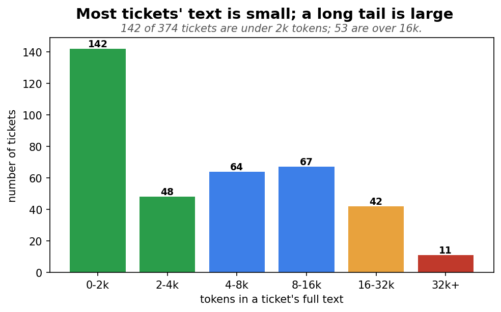
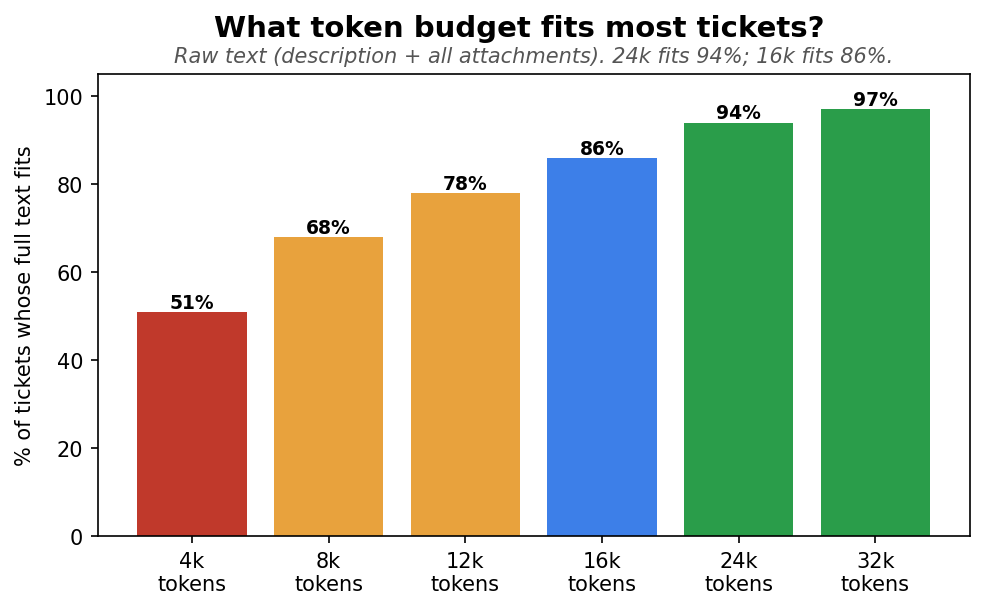
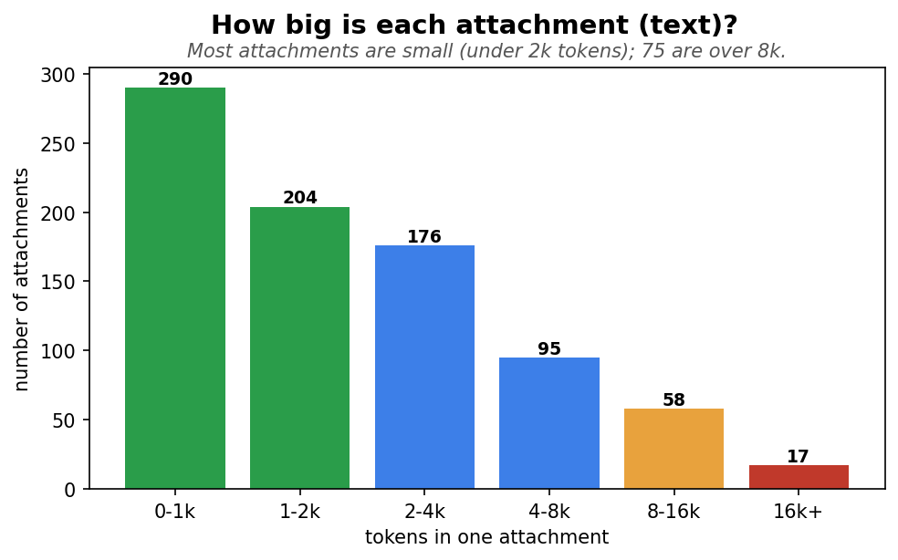
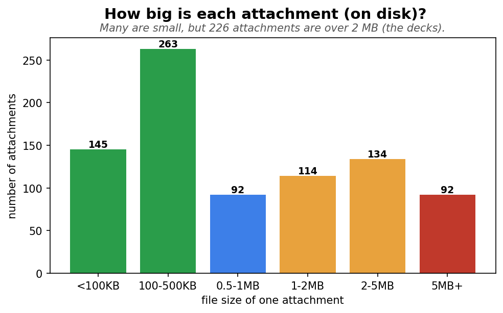
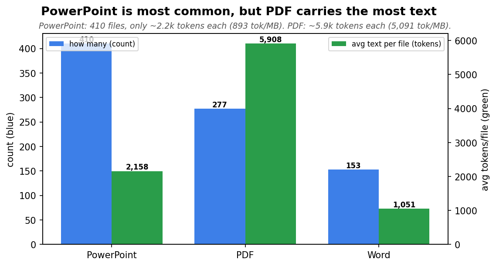
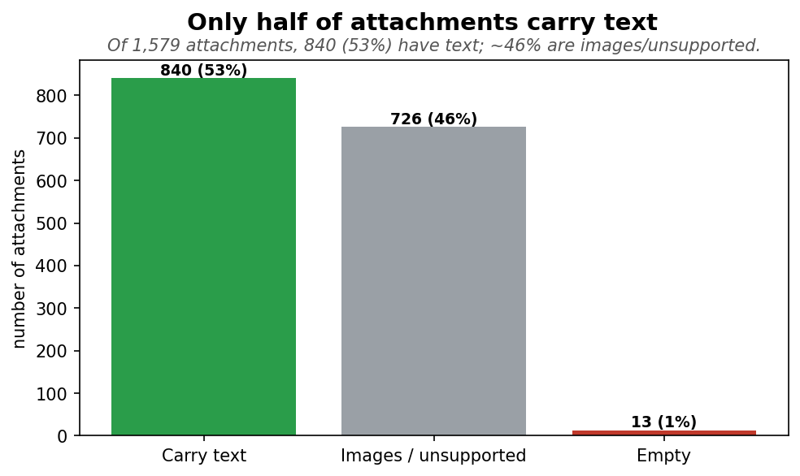

# Can we feed the model the raw ticket text — and how big should we let it get?

*Instead of an LLM-written summary, we want to give the model the **raw ticket text** (description +
attachments). This checks whether that's feasible, and works out **how many attachments to keep** and
**what token budget** to set. Measured on **374 tickets** (a token ≈ ¾ of a word; more tokens = slower
and costlier).*

---

## Bottom line

- **Raw text is feasible** — most tickets are small, and even the largest fits the model.
- **Most tickets are tiny:** the typical ticket's full text is **~3,854 tokens**. A few are huge
  (max ~89k), driven by big PowerPoint decks.
- **18% of tickets have no attachments** — they run on the short description alone (median ~358 tokens),
  a low-context cohort worth flagging.
- **Only ~half of attachments carry text** — of 1,579 attachments, 840 (53%) have extractable text; ~46%
  are images/unsupported. And **PowerPoint dominates by count + size but is the least text-dense — PDFs
  hold the real content.**
- **The recommendation: a ~24k-token budget, packed greedily across attachments — no fixed count cap.**
  At ~24k, **95% of tickets fit untouched**; 16k (lean/fast, 86%) and 32k (generous, 98%) are the other
  operating points.
- **Why budget, not a count:** the token budget is the real lever (a fixed attachment count barely
  changes coverage). So instead of "keep 4," we **pack greedily**: description first, then each
  attachment takes up to the remaining budget — small attachments don't waste their share, big ones
  aren't over-truncated, and the **5th/6th attachment is included whenever it still fits** (6-attachment
  tickets average ~24k, so they usually do).

---

## 1. How big is a ticket's text?

Each bar is the raw text size (description + all attachments) in tokens. **Typical (median) = 3,854** —
half the tickets are smaller. The top 10% reach ~19k, the top 5% ~26k, and the single largest is
**~89k** (one giant deck). The description alone is tiny (median ~358 tokens) — **attachments are what
make a ticket big, and only for a minority.**

The full distribution across all 374 tickets:

**142 of 374 tickets** have under 2k tokens of text; the bulk are under 8k; only **53 tickets** are over
16k (the big-deck minority). The shape is a steep drop with a long right tail.

And how many tickets fit under each token budget (the raw text — description + all attachments):

**A 20k budget fits 91% of tickets; 25k fits 95%; 30k fits 97%** (5k fits just 56%). This is the
descriptive version of the budget decision (the cap-aware version we actually recommend is in section 7).

---

## 2. How many attachments does a ticket have?

Each bar is how many tickets have that many attachments:

- **0 — 67 tickets (18%):** no attachments; the model sees only the short description.
- **1–4 — 269 tickets (72%):** most tickets.
- **5+ — 38 tickets (10%):** the content-heavy minority.

---

## 3. How big is each attachment?

**By text (tokens):**

Most attachments are small — **290 carry under 1k tokens, 204 are 1–2k.** Only 75 attachments are over
8k tokens. So the typical attachment is light; a handful of big ones drive the tail.

**By file size (on disk):**

Plenty of small files, but **226 attachments are over 2 MB** — the big PowerPoint decks. Median
attachment is ~550 KB, but the largest is ~10 MB.

---

## 4. PowerPoint is most common, but PDF carries the most text

This is the standout finding. Comparing the three file types:

| Type | How many | Avg text per file | File size | Text density |
|---|---|---|---|---|
| **PowerPoint** | 410 (most common) | 2,158 tokens | 2.42 MB (biggest) | **893 tokens/MB** (lowest) |
| **PDF** | 277 | **5,908 tokens** (most) | 1.16 MB | **5,091 tokens/MB** (highest) |
| **Word** | 153 | 1,051 tokens | 0.47 MB | 2,243 tokens/MB |

- **PowerPoint dominates by count and by disk size, but is the *least* text-dense** — decks are mostly
  images and layout, so a big 2.4 MB file yields only ~2.2k tokens.
- **PDFs carry the most actual text** (5.9k tokens/file, 6× the density of PowerPoint). The real content
  lives in the PDFs.

*Implication: if attachments ever need trimming, dropping a big low-text PowerPoint costs little content;
dropping a PDF costs a lot.*

---

## 5. Only half of attachments actually carry text

Of **1,579** total attachments across the corpus:

- **840 (53%) carry extracted text** — the PDFs, PowerPoints, and Word docs.
- **~726 (46%) are images or unsupported types** — no text at all (screenshots, diagrams, etc.).
- **13 are empty** (supported but no extractable text).
- **0 idea-card attachments were detected** — worth a flag: the "idea-card-first" selection rule never
  fires on this corpus (the filename pattern isn't matching), so condense always uses the ranked
  attachments packed into the budget.

---

## 6. More attachments → more tokens (and a jump at 5)

Average raw tokens for tickets with each attachment count (ticket count in parentheses):

- **Roughly linear up to 4** — each attachment adds **~3,000 tokens**: 1→3k, 2→6.7k, 3→9.5k, 4→11.7k.
- **A jump at 5 → ~26,520:** five-attachment tickets carry *bigger* attachments (~5.2k each), i.e. the
  big-deck tickets.

So **attachment count is a lever on the token size** — which is exactly why we choose the cap and the
budget together (next).

---

## 7. The decision — budget is the real lever, not the cap

Each line is one attachment cap (keep 1 / 3 / 4 / all). The x-axis is the token budget; the y-axis is
the % of tickets whose text fits under it (no truncation).

- **All lines rise steeply with budget** — 8k → 24k lifts coverage from ~68% to ~95%. **The budget moves
  the needle.**
- **The lines sit close together** (keep-4 and keep-all overlap) — **capping attachments hardly changes
  coverage**, because most tickets are small regardless; the cap only touches the ~10% with 5+.
- **Keep-1 is highest only because it throws away the most content** (next chart) — cheap coverage at a
  real cost.

---

## 8. Keeping 3–4 attachments retains ~all the content

How much of a ticket's attachment text survives each cap:

- **Keep 1 — 77%:** drops a quarter. Too aggressive.
- **Keep 3 — 97%**, **Keep 4 — 99%:** retains essentially everything — the knee.
- **Keep 5 / all — 100%:** the 5th-plus attachment adds under 3% — not worth the extra tokens.

So roughly **3–4 attachments' worth of budget keeps ~all the content** — which is why the greedy
budget-packing in section 9 (which naturally fits ~that many before the budget bites) loses almost
nothing, without needing a hard count cap.

---

## 9. The strategy: greedy budget-packing (no fixed count)

The budget sets coverage:

| Budget | Tickets that fit | Truncated | Best for |
|---|---|---|---|
| 12k | 78% | 22% | very tight latency |
| **16k** | 86% | 14% | lean / fast |
| **24k** | **95%** | 5% | **balanced (recommended)** |
| 32k | 98% | 2% | most generous |

**How the budget is applied — greedily, not as a fixed attachment count:**

1. **Description** first (always, full) — it counts against the budget.
2. **Attachments** in ranked order (text-rich formats first): each takes up to the **remaining**
   budget; stop when the budget is exhausted.

This is better than the old "keep top-4, split the budget evenly":
- a single big deck gets the room it needs instead of an arbitrary 1/N slice;
- small attachments don't waste their slice;
- the **5th/6th attachment is included when it still fits** (a 6-attachment ticket averages ~24k, so it
  usually does) — the old cap-4 would have thrown those away.

The **same budget applies to historical tickets** shown as precedent, so a giant past ticket can't blow
up the prompt.

**Implemented:** `CondenseConfig.doc_char_budget = 96_000` (~24k tokens), greedy packing in
`_consolidate`, `max_attachments = 8` (download/extract cap — the budget, not this count, caps content).

### Why the count cap is 8 (and why it isn't the real limiter)

The 24k-token **budget** decides how much text survives — not the count. So why cap the count at all?
Because the attachment ranker has to **download and extract** each candidate *before* the budget packer
can decide what fits (and extraction is now a serialized native parse). Without a cap, a pathological
ticket with 20–30 attachments would download and parse every one — wasting work on files that could
never fit a 24k budget anyway. The cap bounds that wasted effort; it does **not** bound content.

Two EDA facts set the number at 8:

1. **The budget realistically holds ~4–6 attachments.** Each adds ~3k tokens up to 4 (1→3k, 2→6.7k,
   3→9.5k, 4→11.7k); a 6-attachment ticket averages ~24k. So content-wise the budget is exhausted
   around the 5th–6th attachment.
2. **The cap must sit *above* that**, or it becomes the real limiter and re-introduces the old
   "keep top-4" truncation we deliberately removed. We want the **budget** to decide, with the count
   only catching outliers.

So **8 sits comfortably above the ~6 the budget can hold**: enough candidates for the greedy packer to
fill 24k even when attachments are small, while still capping the rare 15-/20-/30-attachment tickets.
Per the per-ticket distribution, the overwhelming majority of tickets have ≤8 attachments, so 8 almost
never truncates a real set — it only bounds download/extract on outliers.

**Honest caveat:** 8 is a pragmatic guard, not a tuned optimum — anything in the ~6–10 range behaves
almost identically because the budget does the real work. It only bites a ticket with many *small*
attachments where the 9th/10th would have fit; the EDA says that's rare. If we ever want the budget to
be the *sole* limiter, raise the cap to 10–12 or download lazily in ranked order until the budget fills.

---

## The numbers

| Token counts (per ticket) | Median | Top 10% | Top 5% | Max |
|---|---|---|---|---|
| Description only | 358 | 880 | 1,241 | 2,634 |
| **Raw (description + all attachments)** | **3,854** | 19,433 | 25,921 | 88,614 |

| Avg raw tokens by attachment count | 0 | 1 | 2 | 3 | 4 | 5 |
|---|---|---|---|---|---|---|
| avg tokens | 552 | 3,042 | 6,708 | 9,489 | 11,652 | 26,520 |
| tickets | 67 | 93 | 66 | 56 | 54 | 22 |

| Content kept by attachment cap | 1 | 2 | 3 | 4 | 5 |
|---|---|---|---|---|---|
| % of attachment text kept | 77% | 92% | 97% | 99% | 100% |

| Coverage grid (% tickets that fit) | 8k | 12k | 16k | 24k | 32k |
|---|---|---|---|---|---|
| keep 4 attachments | 68% | 78% | 86% | **95%** | 98% |

| Attachments | Value |
|---|---|
| Tickets with none | 67 (18%) |
| Avg per ticket | 2.25 (median 2, max 12) |
| Tokens per attachment | median 1,483 · max 68,768 |
| File types | PowerPoint 49% · PDF 33% · Word 18% |
