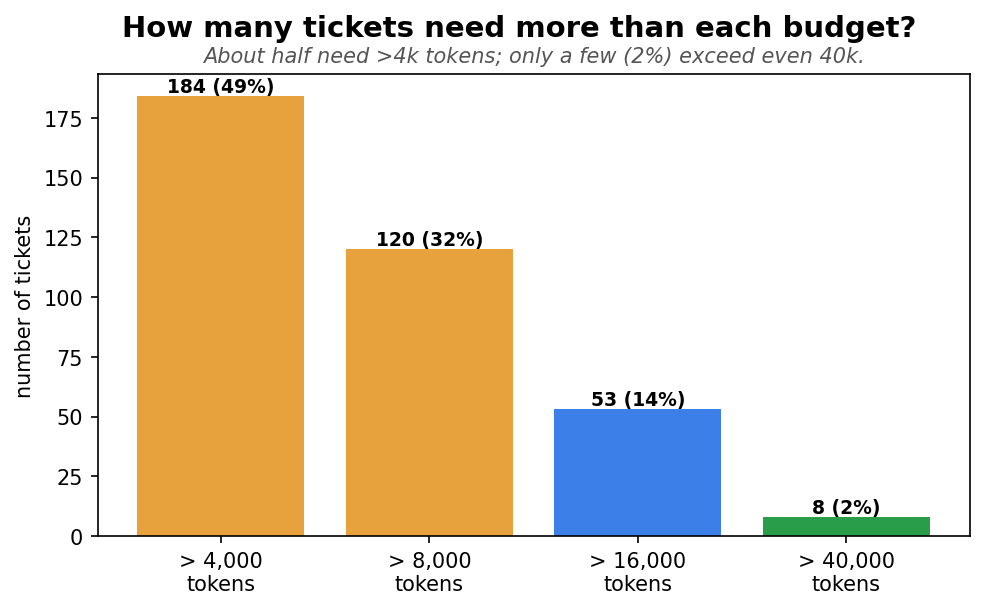
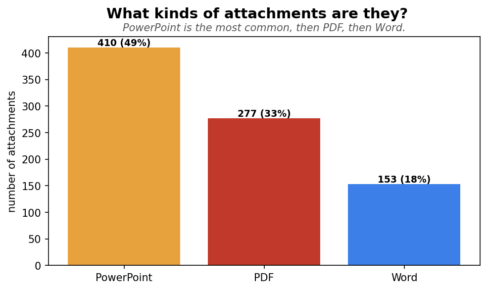

# How much text is in a ticket? (token & attachment analysis)

*To decide whether we can feed the model the **raw ticket text** (description + attachments) instead
of an LLM-written summary — and where to cap it. Measured on **374 tickets** by counting tokens
(the units the model reads) with tiktoken.*

> A **token** is roughly ¾ of a word. The model has a budget of how many tokens it can read at once,
> and more tokens = slower + costlier. So we need to know how big the tickets actually are.

---

## Bottom line

- **Most tickets are small.** The typical (median) ticket's full text is **~3,854 tokens** — tiny.
  Half of all tickets are under that.
- **A few are huge.** The top 5% run to ~26k tokens and the largest single ticket is **~89k tokens** —
  driven by big PowerPoint/PDF attachments.
- **Raw text is feasible** for almost every ticket — even the largest fits the model's context.
- **The token budget is a joint choice with the attachment cap** (how many attachments we keep). The
  fewer attachments we keep, the smaller the budget needed — see the optimization grid (separate doc).
  We have **not** fixed a single limit yet; the grid shows the tradeoff so the data picks it.
- **18% of tickets have no attachments at all** — for those, the only input is the (short) description.

---

## 1. How big is a ticket's text?

**How to read it.** Each bar is the raw text size (description + all attachments) in tokens:

- **Typical (median) — 3,854:** half of tickets are smaller than this. Most tickets are small.
- **Big (top 10%) — 19,433** and **Bigger (top 5%) — 25,921:** a minority are large.
- **Largest — 88,614:** one ticket is huge (a big slide deck).

The description by itself is tiny (median ~358 tokens, max ~2,600) — **attachments are what make a
ticket big**, and only for a minority. *Where to actually cut (the token budget) is decided in the
[optimization doc](token_budget_optimization.md), not here — this section just shows the sizes.*

---

## 2. How many tickets need more than each budget?

**How to read it.** Each bar is how many of the 374 tickets have raw text bigger than that budget
(so a budget there would have to trim them):

- **Over 4k tokens — 184 (49%):** about half the tickets need more than 4k tokens for their full text.
- **Over 8k — 120 (32%)**, **over 16k — 53 (14%):** the higher the budget, the fewer get trimmed.
- **Over 40k — 8 (2%):** only 8 tickets are truly huge.

This is the **descriptive** side of the budget question — *which* budget to pick (and the matching
attachment cap) is worked out in the [optimization doc](token_budget_optimization.md), where the
attachment cap and budget are chosen together.

---

## 3. How many attachments does a ticket have?

**How to read it.** Each bar is how many tickets have that many attachments:

- **0 — 67 tickets (18%):** no attachments — the model only sees the short description.
- **1–4 — 269 tickets (72%):** most tickets. Since we currently keep the top 4 attachments, **these
  tickets lose nothing** — we already use all their attachments.
- **5+ — 38 tickets (10%):** only here does the top-4 rule drop anything. Bumping the limit to 5 would
  fully cover ~94% of tickets; beyond that, diminishing returns.

So the current **top-4 selection already captures every attachment for 90% of tickets** — which is why
trimming to the top 4 barely changes the token count (it keeps ~97% of the raw text on average).

---

## 3b. More attachments → more tokens (and a jump at 5)

**How to read it.** Each bar is the average raw token count for tickets with that many attachments
(ticket count in parentheses):

- **Roughly linear up to 4** — each attachment adds **~3,000 tokens**: 1→3k, 2→6.7k, 3→9.5k, 4→11.7k.
- **A jump at 5 — ~26,520 tokens.** Five-attachment tickets aren't just "one more file" — their
  attachments are individually bigger (~5.2k each vs ~3k), i.e. the content-heavy, big-deck tickets.
- **6+ are noisy** (only 1–7 tickets each), so don't over-read them.

**Why this matters:** attachment count is a **lever for the token budget.** Keeping the limit at **4
attachments holds a ticket under ~12k tokens**; allowing 5+ jumps it to ~27k. So the attachment cap and
the token budget are two ways of controlling the same thing — which is exactly why we choose them
*together* (the optimization grid), rather than fixing either alone.

---

## 4. What kinds of attachments are they?

**How to read it.** Of all the attachments across the corpus:

- **PowerPoint — 410 (49%):** the most common, and usually the biggest (slide decks).
- **PDF — 277 (33%)** and **Word — 153 (18%):** the rest.

PowerPoint dominating explains the big-token tail: a single deck can be tens of thousands of tokens
(the largest attachment alone was ~69k tokens).

---

## What this means — what's settled and what's open

**Settled:**
1. **We can use the raw ticket text** (description + attachments) as the model input instead of an
   LLM-written summary — most tickets are small enough.
2. **Attachment count and token budget are one joint decision** — each attachment adds ~3k tokens up to
   4, then jumps at 5. So we tune them together, not separately.
3. **The 18% no-attachment tickets** run on the description alone (median ~358 tokens) — a low-context
   cohort worth flagging.

**The cap + budget choice → see the [optimization doc](token_budget_optimization.md):**
- The grid there shows the token budget is the real lever (the attachment cap barely changes coverage),
  and that keeping 3–4 attachments retains ~all the content. Its recommendation: **keep 4 attachments +
  a ~24k-token budget** (95% of tickets fit untouched, 99% of content kept) — with 16k (lean) and 32k
  (generous) as the other operating points. Nothing is locked in code yet.

---

## All the numbers

| Token counts (per ticket) | Median | Top 10% | Top 5% | Max |
|---|---|---|---|---|
| Description only | 358 | 880 | 1,241 | 2,634 |
| Attachments only | 3,387 | 19,079 | 24,433 | 87,718 |
| **Raw (description + all attachments)** | **3,854** | **19,433** | **25,921** | **88,614** |

| Tickets over a token budget | > 4k | > 8k | > 16k | > 40k |
|---|---|---|---|---|
| count | 184 | 120 | 53 | 8 |
| share | 49% | 32% | 14% | **2%** |

| Attachments | Value |
|---|---|
| Tickets with none | 67 (18%) |
| Avg per ticket | 2.25 (median 2, max 12) |
| Tokens per attachment | median 1,483 · top 5% 12,224 · max 68,768 |
| File types | PowerPoint 49% · PDF 33% · Word 18% |

| Avg raw tokens by attachment count | 0 | 1 | 2 | 3 | 4 | 5 |
|---|---|---|---|---|---|---|
| avg tokens | 552 | 3,042 | 6,708 | 9,489 | 11,652 | **26,520** |
| tickets | 67 | 93 | 66 | 56 | 54 | 22 |
