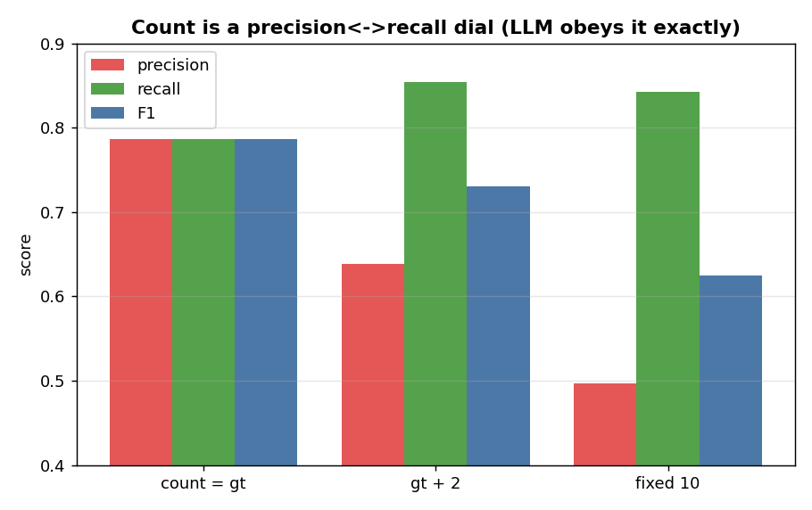
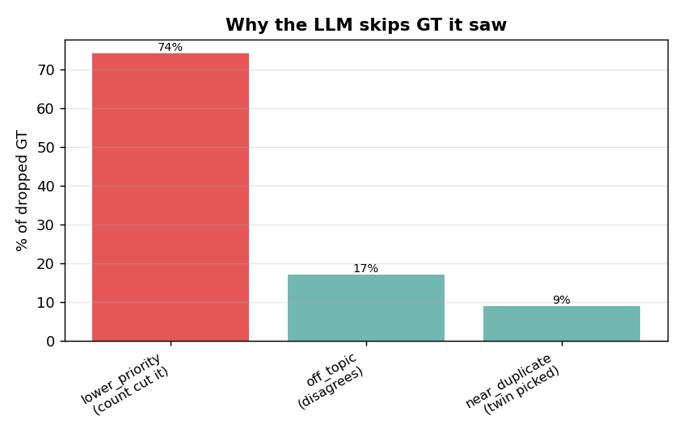
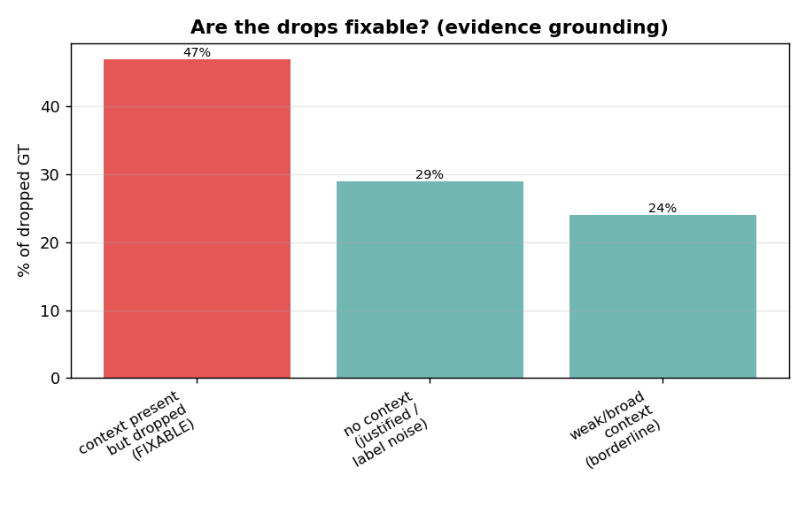

# Value Stream prediction — representation EDA

**Question:** for VS prediction, what text representation works best in each of the three places
text is used — and can we drop summarization to save cost?

**Setup (held constant across every run):**
- 100 tickets with **≥3 ground-truth VS** (`--min-gt 3 --sample 100`, fixed seed) — the hard,
  discriminating cases; single-VS tickets wash out differences.
- `--count-mode gt` — request exactly the GT count, so micro **F1 = P = R** (one clean number per
  run) and no count-generosity bias.
- evidence mode, the Recall selection prompt, K=6 historic neighbours, judge on.

## Terms & token counts (read this first)

Every IDMT ticket produces **two forms of text**. The whole study is about which form goes where.

| term | what it actually is | size |
|---|---|---|
| **raw** | the ticket's description **+** extracted attachment text, consolidated and capped during ingest | **≤ 24,000 tokens** (`doc_char_budget = 96k chars`) |
| **summary** | the condense LLM's output from that raw — 6 fields: generatedSummary, businessProblem, businessCapability, keyTerms, stakeholders, systemsAndProducts | **~460 tokens** (all 6 concatenated) |
| **description** | only the ticket's Jira description field (no attachments) | a few hundred tokens |
| **snippet** | the first ~200 characters of a stored doc | ~50 tokens |
| `raw@Nk` | the **raw** truncated to N-thousand tokens (e.g. `raw@7k` = first ~7,000 tokens of the raw) | N,000 tokens |

These forms get used in **three independent places** per prediction:

| place | what it does | what goes here (winner) |
|---|---|---|
| **Retrieval query** | the text we **embed** to search the index for the 6 nearest past tickets | the **summary** (~460 tok) |
| **New-ticket prompt** | the new ticket's text the LLM **reads to pick the VS** | the **full raw** (~24,000 tok) |
| **Historic block** | each of the 6 retrieved neighbours, shown as precedent in the prompt | each neighbour's **summary** (~460 tok × 6) + its VS labels |

So a run labelled **"raw + summary"** in the tables below means: **new-ticket prompt = raw**,
**historic block = summary** (the retrieval query stays the summary unless the row says `raw@7k`
retrieval). The ladder varies one place at a time.

### The new IDMT ticket is used in BOTH forms

This is the key thing to understand: for the **new** ticket we generate the summary **and** use the
raw — they go to different places:

- its raw (~24k tok) is **summarized** → that **summary** (~460 tok) is what we **embed for the
  retrieval query** (to find the 6 nearest past tickets);
- the **same raw** (~24k tok, in full) is what we put in the **new-ticket prompt** (the text the LLM
  reads to pick the VS).

> **summary to *find*, raw to *decide*.** The new ticket is therefore still summarized — that's why
> summarization can't be dropped. The 6 historic neighbours contribute **only their summaries**
> (their raw is never used in the winner).

## Results


Columns = the form used in each of the three places (see the terms table above).

The **"new ticket summarized?"** column is the one to watch: every row except the last **still
summarizes the new ticket** (its summary is the retrieval query). So those rows are *not* summary-free
configs — they only change how the new ticket's prompt and the historic block are rendered. The
summary is dropped **only** in the last row (raw@7k retrieval).

| run | new ticket summarized? | new-ticket prompt | historic block | retrieval query | **F1 (= P = R)** | avg latency |
|---|---|---|---|---|---|---|
| all-summary | **yes** | summary | summary | summary | 0.715 | 4.2s |
| **raw + summary** | **yes** | **raw** | **summary** | **summary** | **0.786** | 5.8s |
| raw + raw@1500 | **yes** | raw | raw@1500 | summary | 0.781 | 5.6s |
| raw + raw@3000 | **yes** | raw | raw@3000 | summary | 0.768 | 6.3s |
| raw + description | **yes** | raw | description | summary | 0.780 | 4.4s |
| raw + raw@7k | **yes** | raw | raw@7k | summary | 0.780 | 9.4s |
| **raw@7k retrieval** | **NO** | raw@7k | raw@7k | **raw@7k** | **0.742** | 6.6s |

**Don't be misled by the middle rows.** `raw + raw@1500` (0.781) looks close to the winner, but it
**still summarizes** — it just shows the historic neighbours as raw@1500 instead of summary. It is
*not* evidence that raw historic is good or that summarization is droppable; it only says the historic
representation barely matters **when the summary is still doing the retrieval**. The real
summary-free test is the **last row** (the only "NO"), and it **drops to 0.742** — the verdict on
dropping summarization. (An earlier summary-free variant with **raw 7k tok** historic cost 13.9s avg /
132s max latency; cutting historic to 3k fixed the latency but not the quality.)

**How to read it:** the big step is summary→raw on the **new-ticket prompt** (0.715 → 0.786). After
that, swapping the **historic block** representation barely moves F1 (0.768–0.786) — and the last
bar (raw@7k *retrieval*) drops *below* the pack. So the prompt is the lever, the historic block is a
wash, and raw retrieval is a regression.

> **Why F1 = P = R here** (they're normally different): precision = correct ÷ **predicted count**,
> recall = correct ÷ **GT count**. We force the model to return **exactly the GT count**
> (`--count-mode gt`) and it complies (avg predicted 5.9 = avg GT 5.9), so predicted count = GT count
> → the two denominators are equal → **P = R**, and F1 (their mean) equals that too. Pin a *different*
> count (fixed 10, or GT+2) and they'd diverge — we used `count=gt` to get one honest number.

## Finding 1 — the lever is the NEW-TICKET prompt
Feeding the new ticket's **raw text** instead of its summary is **+0.071 F1 (0.715 → 0.786)**.
Retrieval is already perfect at surfacing candidates (every GT reaches the LLM), so all of this gain
is the LLM *choosing* better when it sees the full ticket.

## Finding 2 — the historic block representation is a wash (so use the cheapest)
Among the raw-prompt runs the historic block spans only 0.768–0.786: summary (0.786) ≈ description
(0.780) ≈ raw@1500 (0.781) ≈ raw@7k (0.780), with raw@3000 slightly *worse* (0.768). More raw
precedent does **not** help — it dilutes. **Summary historic is marginally best and the cheapest.**

## Finding 3 — summary retrieval beats raw@7k retrieval (the cost question)


To test dropping summarization entirely, we re-embedded the index on **raw@7k** (no summary) and
retrieved with raw. The decider is **historic-lane recall** — did the precedent search surface the
GT (in evidence mode the 50-VS candidate pool makes review-pool recall structurally 1.0, so *that*
isn't the signal — the historic lane is).

- summary retrieval: historic-lane R **0.902** → F1 **0.786**
- raw@7k retrieval: historic-lane R **0.843** → F1 **0.754**

**How to read it:** the ~460-token summary embeds the *whole* ticket cleanly; raw@7k keeps only ~half
of a big ticket, so it retrieves **worse neighbours**. Since precedent drives recall (GT *backed* by
historic is picked ~0.82, *not-backed* only ~0.38), worse precedent → lower recall → ~3 F1 points
lost. **Dropping the summary costs quality.**

## Finding 4 — feed the new ticket's FULL raw; don't cap it


Holding everything else at the winner (summary retrieval + summary historic) and changing only the
new ticket's raw cap: the **full ~24k raw** scores **0.780** vs **0.759** at a 7k cap — capping loses
~2 points of F1. The extra context genuinely helps the LLM decide, and latency was identical (~4s)
either way, so **there's no reason to cap the new-ticket prompt.**

## Where the time goes (latency split)


**How to read it:** splitting prediction latency into retrieval vs the LLM call shows **retrieval is
sub-second** (0.38–0.79s) — never the bottleneck. The **LLM call is the whole cost**, and it tracks
the **historic block size**: summary historic 3.7s vs raw@3k historic 5.8s. So the cheap lever for
latency is the historic representation (keep it summary), not the new-ticket prompt.

**Avg vs max latency** (per-ticket, prediction only; the max is the slowest single ticket in the run):

| config | new-ticket prompt | historic | avg | **max** |
|---|---|---|---|---|
| winner | raw ~24k tok | summary ~460 tok ×6 | **3.7s** | **6.9s** |
| capped winner | raw 7k tok | summary ~460 tok ×6 | 3.7s | 6.9s |
| fully-raw (confirmation) | raw 7k tok | **raw 3k tok ×6** | 5.8s | 21.7s |
| raw@7k historic (earlier) | raw 7k tok | **raw 7k tok ×6** | 13.9s | **132s** |

The winner's max is **6.9s** — tight, because the prompt is one ~24k-token ticket + six ~460-token
summaries. The moment the historic block goes raw, the max blows out: **3k raw historic → 21.7s max**,
**7k raw historic → 132s max** (6 × 7k = 42k tokens of precedent → a ~55k-token prompt). Average hides
this; the **max is what a user actually waits** on a bad-luck ticket — another reason to keep historic
as summary.

## Latency / cost


**How to read it:** latency tracks the LLM **prompt size**. summary historic ≈ 6×460 tokens; raw@7k
historic ≈ 6×7k = 42k tokens, which blows the prompt to ~55k tokens and spikes prediction to 132s on
big-neighbour tickets. This is a *second* cost axis, independent of the summary question: even if you
keep summaries, **never ship raw@7k historic** — it's ~4–5× the runtime token cost for zero quality.

## Count behaviour — does the LLM follow the requested count?

We pass a target count to the model. Two questions: (a) does it actually return that many on its
own, and (b) when it skips a correct VS it *saw*, why? Run on the winner config, 100 gt≥3 tickets.

### The LLM obeys the count exactly — to a fault

| count requested | followed | padded by us | avg LLM picked |
|---|---|---|---|
| fixed 10 | **100%** | **0%** | 10.0 |
| gt + 2 | **100%** | **0%** | 7.9 |

It returns **exactly** the requested count every time — we never had to pad. But it obeys
*literally*: asked for 10 it returns 10 even when only ~6 are right, **filling the spare slots with
weaker picks**. So the count is a real, fully-obeyed **precision↔recall dial**:



| count mode | avg predicted | recall | precision | F1 |
|---|---|---|---|---|
| count = gt | 5.9 | 0.786 | 0.786 | **0.786** |
| gt + 2 | 7.9 | **0.854** | 0.638 | 0.730 |
| fixed 10 | 10.0 | 0.842 | 0.497 | 0.625 |

**How to read it:** more slots → recall climbs (0.786 → 0.854) but precision falls faster → F1 drops.
Best F1 is at `count = gt`. Crucially, recall at `count = gt` is **genuinely capped** — giving +2
slots recovers ~7 points of recall, i.e. the model *was* dropping real GT just to fit the exact count.

### Why it skips GT it saw — mostly the count, not quality



Every miss is `llm_dropped` (the GT reached the LLM — retrieval is perfect — and it didn't pick it).
Re-prompting the model on each dropped GT buckets the reason:

| reason | share | meaning |
|---|---|---|
| **lower_priority** | **~74%** | relevant, but less central than the picks — the **count** squeezed it out |
| off_topic | ~17% | the model genuinely disagrees with the GT label |
| near_duplicate_of_pick | ~9% | a near-twin was picked instead |

**The two tests tie together:** ~75% of misses are `lower_priority`, and Test 1 *proves* that's the
count — give the model +2 slots and recall jumps 0.786 → 0.854, recovering exactly those VS. So
**most "misses" aren't the model being wrong; they're the count constraint doing its job.** Only
~17% are genuine disagreement (and the judge says ~25% of *those* are actually supported — GT label
noise). The genuinely fixable error surface is small (~17% off_topic + ~9% near-duplicate).

**Implication:** for the shortlist-then-trim product flow, pass **gt+2** — recall ~0.85, the model
surfaces the relevant-but-lower-priority VS, and judge precision still holds (~0.71) so the extras are
mostly fine. For best F1 / autonomous output, use **count = gt**.

## Drop diagnosis — is the gap fixable, and can a prompt fix it?

We went deeper on the `count=gt` drops (131 of them, 100 gt≥3 tickets) with three probes: an
evidence-grounding classifier, an independent 0-1 score of every candidate, and a comparative "why
did the picks win" probe.



**Grounding — how much is even fixable:**

| bucket | share | meaning |
|---|---|---|
| **context_present_but_dropped** | **47%** | the ticket supported it, the block showed it, dropped anyway — the fixable headroom |
| no_context_for_gt | 29% | the ticket has no support — the BA tagged it from outside knowledge — **not** fixable from text (label noise) |
| weak_broad_context | 24% | only indirect/downstream evidence — borderline |

**The model rates them relevant, then drops them.** Scored *independently* (no count pressure),
**81% of dropped GT scored ≥ a candidate the model actually kept.** So the model's relevance
judgement is consistent; the single count-limited "pick N" call is where it goes wrong — it ranks
others higher and the count cutoff chops the rest. The comparative probe shows *what* it favours:
the picks win as `picks_more_specific` (25%) / `picks_more_prominent` (8%), and the dropped GT lose as
`dropped_too_broad` (39%) / `no_evidence_for_dropped` (27%). Only **2%** are misses the model itself
calls genuine.

**The root cause: the model is text-anchored; the BA is experience-anchored.** The model rewards what
the idea card spells out (specific, named, prominent) and under-weights the broad / downstream /
precedent-implied streams — which is exactly the kind a Business Architect includes from experience.
That is the core gap, and it's why precedent matters so much (GT *backed* by a similar past ticket is
picked ~0.83 vs ~0.30 when unbacked): the historic block is the only thing that gives the model
evidence for the broad/implied streams it would otherwise drop.

### Prompt engineering — tried, and why it didn't move F1

We built `selection_evidence_recall_v2`, targeting the diagnosis directly: a **consistency** rule
(don't drop a candidate as well-supported as your weakest pick — aimed at the 81% near-miss), a
**broad/downstream reframe** (a broad stream is valid when the work flows through it; exclude only
filler — aimed at the 39%+24%), and **near-twin care** (siblings can both apply). A/B on the same 100
tickets:

| prompt | F1 | P@6 | R@6 | judge F1 |
|---|---|---|---|---|
| v1 winner | 0.778 | 0.791 | 0.692 | 0.816 |
| v2 (targeted) | **0.776** | 0.803 | 0.705 | **0.829** |

**Strict F1 did not move** (0.776 vs 0.778, noise) — the rank/judge metrics ticked up a hair, the drop
profile was unchanged. **Why:** the inconsistency is **structural, not promptable.** The model already
*knows* the dropped GT is relevant (the 81% near-miss) — you cannot *talk* a single count-limited call
into being consistent. Three prompt iterations would all land here. The lever is the **selection
policy** (the count, or a two-stage score-then-select), not the wording.

**Decision: stop here.** Prompt wording is at its ceiling, and judge-F1 0.829 means ~⅓ of the
remaining "misses" are actually relevant (GT-label noise) — so true quality is already ~0.83. A
two-stage *score-then-select* path was built (config `score_select`) as the one structural idea that
could exploit the 81% near-miss, but we are **not pursuing it**: the realistic upside is small, the
precision risk is real (generous scoring also lifts the magnet false-positives), and `count=gt`
strict-0.78 / judge-0.83 is accepted as the corpus ceiling for selection-from-text. **VS selection is
locked on the v1 winner.**

## Verdict
**Locked config: summary retrieval + FULL ~24k raw new-ticket prompt + summary historic — F1 ≈0.78–0.79.**

- The summary you "can't eliminate" turns out to be the thing buying your best retrieval.
- Dropping summarization (raw@7k retrieval) is a **regression** (0.780 → 0.742, historic-lane R
  0.902 → 0.840), not a marginal trade. The summary-free idea is dead.
- The new-ticket **raw** prompt is the real win (+0.07) — and feed it **in full**; a 7k cap costs ~2pts.
- Use the **cheapest** historic block (summary): same quality as raw, and it's what keeps the LLM
  call (the only real latency) at ~3.7s. Retrieval is sub-second regardless.

## Final config (locked) — the per-ticket flow

```
1. New ticket raw, consolidated to <=24k tokens
2. Summarize it (condense LLM)  -> summary fields
3. Embed the summary -> search the index -> retrieve the 6 nearest past tickets
4. Build the selection prompt:
      - the new ticket's FULL raw (~24k)                 ("raw to decide")
      - the 6 neighbours' summaries + their VS labels     ("summaries as precedent")
      - the 50-VS catalogue
5. LLM picks the VS  (count = requested; evidence mode, Recall prompt)
```

The two uses of "summary" are different field sets, by design:
- **Retrieval query** embeds **all six** summary fields (generatedSummary + businessProblem +
  businessCapability + keyTerms + stakeholders + systemsAndProducts).
- **Historic block** shows each neighbour's **generatedSummary only** + its VS labels.

So every new ticket contributes **both** its summary (to *find* precedent) and its full raw (to
*decide*) — which is exactly why summarization stays in the pipeline.

**Selection** stays on the **v1 evidence-recall prompt at `count=gt`** (use `gt+2` only for the
shortlist-then-trim flow). Prompt wording is at its ceiling; the drop gap is structural (text-anchored
model vs experience-anchored BA) and ~⅓ label noise. **This EDA is closed — VS prediction is locked.**
