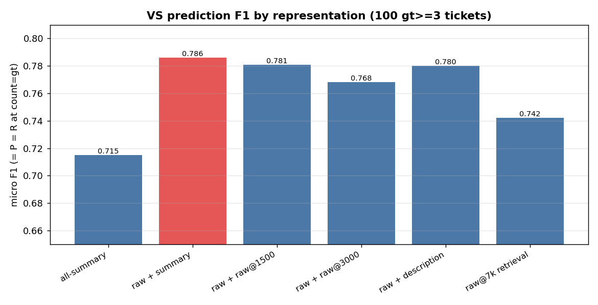
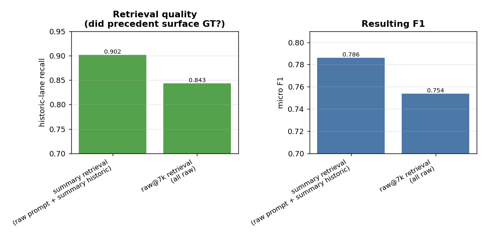
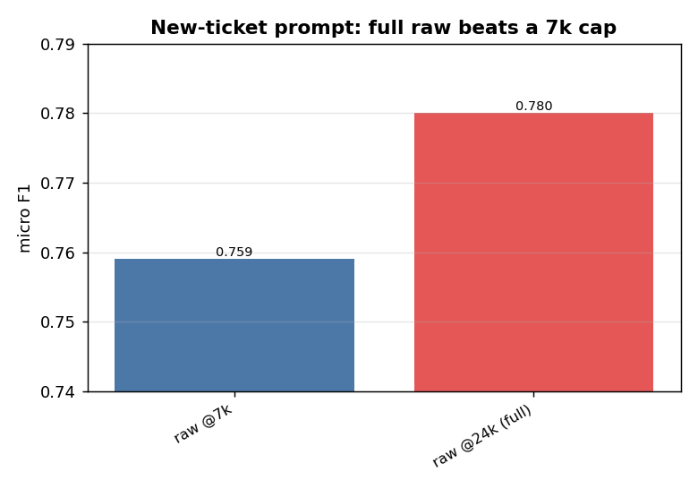
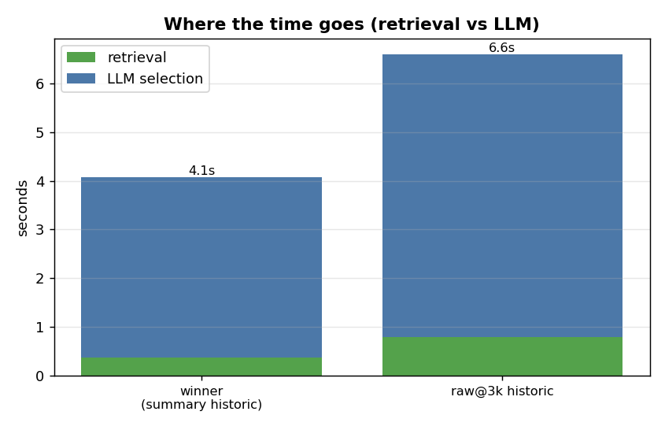
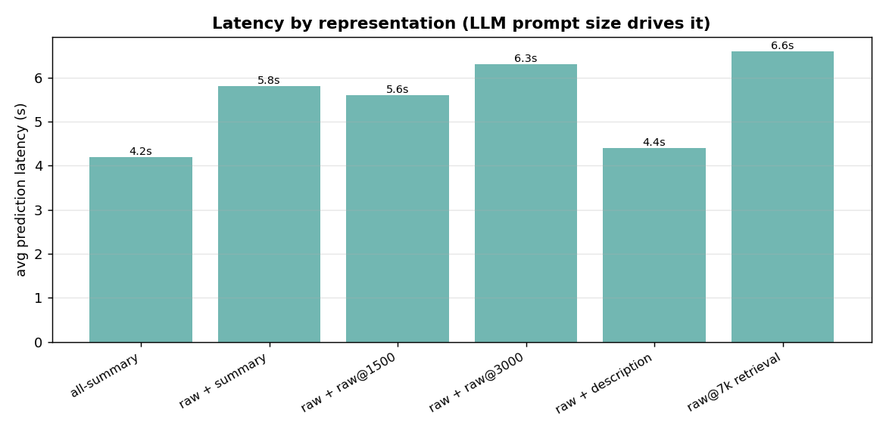

# Value Stream prediction — representation EDA

**Question:** for VS prediction, what text representation works best in each of the three places
text is used — and can we drop summarization to save cost?

**Setup (held constant across every run):**
- 100 tickets with **≥3 ground-truth VS** (`--min-gt 3 --sample 100`, fixed seed) — the hard,
  discriminating cases; single-VS tickets wash out differences.
- `--count-mode gt` — request exactly the GT count, so micro **F1 = P = R** (one clean number per
  run) and no count-generosity bias.
- evidence mode, the Recall selection prompt, K=6 historic neighbours, judge on.

## Terms & token counts (read this first)

Every IDMT ticket produces **two forms of text**. The whole study is about which form goes where.

| term | what it actually is | size |
|---|---|---|
| **raw** | the ticket's description **+** extracted attachment text, consolidated and capped during ingest | **≤ 24,000 tokens** (`doc_char_budget = 96k chars`) |
| **summary** | the condense LLM's output from that raw — 6 fields: generatedSummary, businessProblem, businessCapability, keyTerms, stakeholders, systemsAndProducts | **~460 tokens** (all 6 concatenated) |
| **description** | only the ticket's Jira description field (no attachments) | a few hundred tokens |
| **snippet** | the first ~200 characters of a stored doc | ~50 tokens |
| `raw@Nk` | the **raw** truncated to N-thousand tokens (e.g. `raw@7k` = first ~7,000 tokens of the raw) | N,000 tokens |

These forms get used in **three independent places** per prediction:

| place | what it does | what goes here (winner) |
|---|---|---|
| **Retrieval query** | the text we **embed** to search the index for the 6 nearest past tickets | the **summary** (~460 tok) |
| **New-ticket prompt** | the new ticket's text the LLM **reads to pick the VS** | the **full raw** (~24,000 tok) |
| **Historic block** | each of the 6 retrieved neighbours, shown as precedent in the prompt | each neighbour's **summary** (~460 tok × 6) + its VS labels |

So a run labelled **"raw + summary"** in the tables below means: **new-ticket prompt = raw**,
**historic block = summary** (the retrieval query stays the summary unless the row says `raw@7k`
retrieval). The ladder varies one place at a time.

### The new IDMT ticket is used in BOTH forms

This is the key thing to understand: for the **new** ticket we generate the summary **and** use the
raw — they go to different places:

- its raw (~24k tok) is **summarized** → that **summary** (~460 tok) is what we **embed for the
  retrieval query** (to find the 6 nearest past tickets);
- the **same raw** (~24k tok, in full) is what we put in the **new-ticket prompt** (the text the LLM
  reads to pick the VS).

> **summary to *find*, raw to *decide*.** The new ticket is therefore still summarized — that's why
> summarization can't be dropped. The 6 historic neighbours contribute **only their summaries**
> (their raw is never used in the winner).

## Results



Columns = the form used in each of the three places (see the terms table above).

| run | new-ticket prompt | historic block | retrieval query | **F1** | exact-set | avg latency |
|---|---|---|---|---|---|---|
| all-summary | summary | summary | summary | 0.715 | 23% | 4.2s |
| **raw + summary** | **raw** | **summary** | **summary** | **0.786** | **36%** | 5.8s |
| raw + raw@1500 | raw | raw@1500 | summary | 0.781 | 26% | 5.6s |
| raw + raw@3000 | raw | raw@3000 | summary | 0.768 | 24% | 6.3s |
| raw + description | raw | description | summary | 0.780 | 31% | 4.4s |
| raw + raw@7k | raw | raw@7k | summary | 0.780 | 30% | 9.4s |
| **raw@7k retrieval** | raw@7k | raw@7k | **raw@7k** | **0.742** | 23% | 6.6s |

The last row drops the summary entirely (raw-embedded index + raw everything). On a clean 100/100
with cheap raw@3k historic it lands at **0.742** — below the pack. (An earlier raw@7k-*historic*
variant cost 13.9s avg / 132s max latency; dropping it to 3k fixed the latency but not the quality.)

**How to read it:** the big step is summary→raw on the **new-ticket prompt** (0.715 → 0.786). After
that, swapping the **historic block** representation barely moves F1 (0.768–0.786) — and the last
bar (raw@7k *retrieval*) drops *below* the pack. So the prompt is the lever, the historic block is a
wash, and raw retrieval is a regression.

## Precision, recall & exact-set

**At `count=gt`, micro F1 = precision = recall.** The model returns exactly the GT count, so the
predicted set is the same size as GT → `tp+fp = tp+fn` → P = R = F1. **So every F1 above is also that
run's precision and recall** (winner: P = R = F1 = 0.786). That's *why* we use `count=gt` — one
honest number, no count-generosity inflating recall.

**exact-set** = the share of tickets where the predicted VS set is **exactly** the GT set — every
correct VS picked and **zero** wrong (`fp = 0` *and* `fn = 0`). It's all-or-nothing per ticket, so
it's far stricter than F1 (which gives partial credit for getting *some* of the VS right). The winner
scores F1 0.786 but only **36% perfectly right** — on the other ~64% it's partially correct.

The **rank metrics P@6 / R@6** *do* differ from F1 — precision/recall of the GT inside the top-6
retrieved candidates (a retrieval-quality view, before the LLM's final pick):

| run | F1 (= P = R) | P@6 | R@6 | exact-set |
|---|---|---|---|---|
| all-summary | 0.715 | 0.741 | 0.648 | 23% |
| **raw + summary (winner)** | **0.786** | **0.815** | **0.715** | **36%** |
| raw + raw@1500 | 0.781 | 0.792 | 0.697 | 26% |
| raw + raw@3000 | 0.768 | 0.779 | 0.683 | 24% |
| raw + description | 0.780 | 0.809 | 0.708 | 31% |
| raw + raw@7k | 0.780 | 0.796 | 0.697 | 30% |
| raw@7k retrieval | 0.742 | 0.762 | 0.663 | 23% |

## Finding 1 — the lever is the NEW-TICKET prompt
Feeding the new ticket's **raw text** instead of its summary is **+0.071 F1 (0.715 → 0.786)** and
nearly doubles exact-set (23% → 36%). Retrieval is already perfect at surfacing candidates (every GT
reaches the LLM), so all of this gain is the LLM *choosing* better when it sees the full ticket.

## Finding 2 — the historic block representation is a wash (so use the cheapest)
Among the raw-prompt runs the historic block spans only 0.768–0.786: summary (0.786) ≈ description
(0.780) ≈ raw@1500 (0.781) ≈ raw@7k (0.780), with raw@3000 slightly *worse* (0.768). More raw
precedent does **not** help — it dilutes. **Summary historic is marginally best and the cheapest.**

## Finding 3 — summary retrieval beats raw@7k retrieval (the cost question)



To test dropping summarization entirely, we re-embedded the index on **raw@7k** (no summary) and
retrieved with raw. The decider is **historic-lane recall** — did the precedent search surface the
GT (in evidence mode the 50-VS candidate pool makes review-pool recall structurally 1.0, so *that*
isn't the signal — the historic lane is).

- summary retrieval: historic-lane R **0.902** → F1 **0.786**
- raw@7k retrieval: historic-lane R **0.843** → F1 **0.754**

**How to read it:** the ~460-token summary embeds the *whole* ticket cleanly; raw@7k keeps only ~half
of a big ticket, so it retrieves **worse neighbours**. Since precedent drives recall (GT *backed* by
historic is picked ~0.82, *not-backed* only ~0.38), worse precedent → lower recall → ~3 F1 points
lost. **Dropping the summary costs quality.**

## Finding 4 — feed the new ticket's FULL raw; don't cap it



Holding everything else at the winner (summary retrieval + summary historic) and changing only the
new ticket's raw cap: the **full ~24k raw** scores **0.780** vs **0.759** at a 7k cap — capping loses
~2 points and drops exact-set 31% → 26%. The extra context genuinely helps the LLM decide, and
latency was identical (~4s) either way, so **there's no reason to cap the new-ticket prompt.**

## Where the time goes (latency split)



**How to read it:** splitting prediction latency into retrieval vs the LLM call shows **retrieval is
sub-second** (0.38–0.79s) — never the bottleneck. The **LLM call is the whole cost**, and it tracks
the **historic block size**: summary historic 3.7s vs raw@3k historic 5.8s. So the cheap lever for
latency is the historic representation (keep it summary), not the new-ticket prompt.

## Latency / cost



**How to read it:** latency tracks the LLM **prompt size**. summary historic ≈ 6×460 tokens; raw@7k
historic ≈ 6×7k = 42k tokens, which blows the prompt to ~55k tokens and spikes prediction to 132s on
big-neighbour tickets. This is a *second* cost axis, independent of the summary question: even if you
keep summaries, **never ship raw@7k historic** — it's ~4–5× the runtime token cost for zero quality.

## Verdict
**Locked config: summary retrieval + FULL ~24k raw new-ticket prompt + summary historic — F1 ≈0.78–0.79.**

- The summary you "can't eliminate" turns out to be the thing buying your best retrieval.
- Dropping summarization (raw@7k retrieval) is a **regression** (0.780 → 0.742, historic-lane R
  0.902 → 0.840), not a marginal trade. The summary-free idea is dead.
- The new-ticket **raw** prompt is the real win (+0.07) — and feed it **in full**; a 7k cap costs ~2pts.
- Use the **cheapest** historic block (summary): same quality as raw, and it's what keeps the LLM
  call (the only real latency) at ~3.7s. Retrieval is sub-second regardless.

## Final config (locked) — the per-ticket flow

```
1. New ticket raw, consolidated to <=24k tokens
2. Summarize it (condense LLM)  -> summary fields
3. Embed the summary -> search the index -> retrieve the 6 nearest past tickets
4. Build the selection prompt:
      - the new ticket's FULL raw (~24k)                 ("raw to decide")
      - the 6 neighbours' summaries + their VS labels     ("summaries as precedent")
      - the 50-VS catalogue
5. LLM picks the VS  (count = requested; evidence mode, Recall prompt)
```

The two uses of "summary" are different field sets, by design:
- **Retrieval query** embeds **all six** summary fields (generatedSummary + businessProblem +
  businessCapability + keyTerms + stakeholders + systemsAndProducts).
- **Historic block** shows each neighbour's **generatedSummary only** + its VS labels.

So every new ticket contributes **both** its summary (to *find* precedent) and its full raw (to
*decide*) — which is exactly why summarization stays in the pipeline. **No further changes.**
